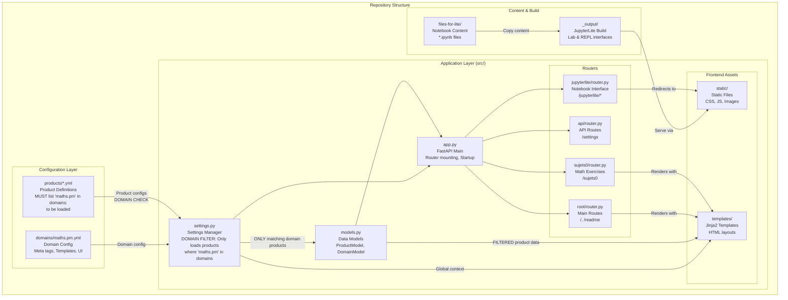

# 📚 Maths.pm - FastAPI Application (Public Unstable)

A production-grade FastAPI app for Maths.pm educational resources with first-class JupyterLite integration. This repository is now public and tagged as “unstable” to accelerate collaboration. Expect rapid changes and potential breaking updates until we cut the first stable tag.

This document is comprehensive to help you evaluate, run, audit, and contribute safely.

## 🚀 **Quick Start**

### **Install Dependencies**
```bash
pip install -r requirements.txt
```

### **Run the Application**

**Method 1: Uvicorn (Recommended)**
```bash
uvicorn src:app --host 0.0.0.0 --port 8000 --reload --log-level info
```

**Method 2: Python Module**
```bash
python -m src
```

**Server runs at: http://localhost:8000**

## 🔗 **All Available Routes & Views**

### 📋 **Main Application**
- **`/`** - Homepage displaying all educational products and resources
- **`/api/products`** - JSON API returning all available products
- **`/api/health`** - Application health check and status

### 🎯 **Educational Tools (Sujets0)**
- **`/sujets0`** - Interactive mathematics question generator with Nagini (Python in browser)
- **`/sujets0/ex-ante-generated`** - Pre-generated questions viewer (instant, no Python execution)
- **`/scenery`** - Testing environment for Nagini and generator development

### 🔬 **JupyterLite Views** (Complete Suite)

#### **Primary Interfaces**
- **`/jupyterlite/`** - Smart entry point (auto-redirects to Lab)
- **`/jupyterlite/lab`** - **Full Jupyter Lab** - Complete notebook environment with file browser, extensions, multiple tabs
- **`/jupyterlite/repl`** - **Python REPL** - Interactive console for quick code execution and learning
- **`/jupyterlite/embed`** - **Demo Page** - Shows both Lab and REPL side-by-side for comparison

#### **Specialized Views**
- **`/jupyterlite/sandbox/repl`** - Clean, full-screen REPL interface (perfect for embedding)

#### **Backward Compatibility** (Old links still work)
- **`/jupyter`** - Redirects to `/jupyterlite/lab` (permanent redirect)
- **`/jupyter/repl`** - Redirects to `/jupyterlite/repl` (permanent redirect)

#### **Direct Static Access** *(For Advanced Users)*
- **`/static/jupyterlite/_output/lab/index.html`** - Direct Lab access
- **`/static/jupyterlite/_output/repl/index.html`** - Direct REPL access

### 📁 **Static Assets**
- **`/static/`** - CSS, JavaScript, images, and other static files

## 📚 **JupyterLite Integration Details**

**JupyterLite is enabled by default** and provides:
- 🐍 **Python notebooks** running entirely in the browser
- 📊 **Scientific libraries**: NumPy, Matplotlib, SymPy
- 🔬 **Interactive mathematics** education environment
- 🚀 **No server required** - runs on Pyodide/WebAssembly
- 🎨 **Multiple interfaces** for different use cases

### **When to Use Each JupyterLite View:**

| View | Best For | Use Case |
|------|----------|----------|
| **Lab** | Data science, complex projects | Full notebook development, multiple files |
| **REPL** | Quick calculations, learning | Testing code snippets, math homework |
| **Embed** | Demonstrations, comparisons | Showing capabilities to new users |
| **Sandbox REPL** | Clean embedding | Integration into other websites |

**Disable JupyterLite:**
```bash
export JUPYTERLITE_ENABLED=false
uvicorn src:app --host 0.0.0.0 --port 8000 --reload --log-level info
```

## 🧪 **Testing All Views**

Start your server and try these links:

```bash
# Start the server
uvicorn src:app --host 0.0.0.0 --port 8000 --reload

# Main application
curl http://localhost:8000/                    # Homepage
curl http://localhost:8000/api/products        # Products API
curl http://localhost:8000/api/health          # Health check

# Documentation
# Visit: http://localhost:8000/readme          # Beautiful README view

# Educational tools
# Visit: http://localhost:8000/sujets0         # Math exercises (live generation)
# Visit: http://localhost:8000/sujets0/ex-ante-generated  # Pre-generated questions

# Generate questions (one-time setup for pre-generated viewer)
python src/build_questions.py

# JupyterLite views (visit in browser)
# http://localhost:8000/jupyterlite/lab        # Full Lab
# http://localhost:8000/jupyterlite/repl       # REPL console
# http://localhost:8000/jupyterlite/embed      # Demo page
# http://localhost:8000/jupyter                # Old link (redirects)
```

## 📁 **Project Structure & Architecture**

The application follows a **configuration-driven architecture** where YAML files define the behavior and content, while the Python code provides the framework:



### **Key Architecture Concepts**

#### 🌐 Configuration Layer
- **`domains/maths.pm.yml`**: Domain-wide settings (meta tags, templates, branding)
- **`products/*.yml`**: Individual service definitions with backend settings
- **Domain filtering**: Products are loaded only if they match the current domain

#### ⚙️ Application Layer
- **`settings.py`**: Central configuration manager that loads and validates YAML configs
- **`models.py`**: Pydantic models for type-safe configuration handling
- **`app.py`**: FastAPI application with modular router architecture

#### 🛣️ Router Organization
- **Modular routers**: Each feature has its own router (root, api, sujets0, jupyterlite)
- **Conditional mounting**: JupyterLite router only loads if enabled
- **Backward compatibility**: Old `/jupyter` routes redirect to new `/jupyterlite` routes

#### 📚 Content Pipeline
- **`files-for-lite/`**: Source notebooks and content
- **`_output/`**: JupyterLite build artifacts (generated at startup)
- **`static/`**: Served assets including the built JupyterLite interface

### Directory Structure
```
pca-mathspm/
├── domains/                # 🌐 Domain configurations
│   └── maths.pm.yml        # Domain-specific settings
├── products/               # 📦 Product definitions  
│   ├── 01_nagini.yml       # Python-in-browser tool
│   ├── 02_jupyterlite.yml  # Notebook environment
│   ├── 14_sujets0.yml      # Math exercise generator
│   └── ...                 # More products
├── src/                    # ⚙️ Application code
│   ├── api/                # 🔌 JSON API routes
│   ├── jupyterlite/        # 🔬 Notebook interface routes
│   ├── sujets0/            # 📚 Math exercise routes  
│   ├── root/               # 🏠 Main page routes
│   ├── static/             # 📁 CSS, JS, images
│   ├── templates/          # 📄 Jinja2 HTML templates
│   ├── app.py              # 🚀 FastAPI application
│   ├── settings.py         # ⚙️ Configuration manager
│   └── models.py           # 📋 Data models
├── files-for-lite/         # 📓 Notebook source content
└── _output/                # 🏗️ JupyterLite build (generated)
```

## 🛠️ Development

**Auto-reload is enabled** - the server watches for changes in Python files, YAML configurations, and templates.

**Health Check:**
```bash
curl http://localhost:8000/api/health
```
```json
{
  "status": "healthy",
  "products_loaded": 6,
  "version": "0.1.0",
  "jupyterlite_enabled": true,
  "domain": "maths.pm"
}
```

## 🎯 Key Features

- ✅ **Modern FastAPI** with async support and organized router architecture
- ✅ **Complete JupyterLite suite** with 5 different views for various use cases
- ✅ **Backward compatibility** - old links continue to work
- ✅ **Educational focus** - specialized tools for mathematics education
- ✅ **Strict configuration** with strictyaml validation
- ✅ **Server-side rendering** with Jinja2 templates
- ✅ **Hot reload** for rapid development
- ✅ **Conditional features** - disable components as needed

## 🎓 Educational Use Cases

### For Teachers
- Use `/jupyterlite/embed` to demonstrate both interfaces to students
- Start beginners with `/jupyterlite/repl` (less overwhelming)
- Graduate advanced students to `/jupyterlite/lab` (more powerful)
- Use `/sujets0` for French mathematics exam preparation

### For Students
- **Homework**: Use REPL for quick calculations and verification
- **Projects**: Use Lab for complex data analysis and visualization
- **Learning**: Progress from REPL → Lab as skills develop

### For Integration
- **Website embedding**: Use sandbox views for clean integration
- **Demonstrations**: Use embed view to showcase capabilities
- **Direct access**: Link to specific Lab or REPL as needed

---

**Built with FastAPI + JupyterLite + strictyaml** 🚀

---

## 🧩 PM Namespace, Components, and Frontend Architecture

We progressively enhance server-rendered PM pages with web components (Lit). Each fragment type (f_type) can be upgraded to a component for dynamic behavior while preserving SEO and first paint. All code lives under:

- `@js/pm/*` → `src/static/js/pm/*`
- `@core/css/pm.css` → `src/static/core/css/pm.css`

Entry point: `@js/pm/main.js` exports `PMRuntime` with APIs to initialize dynamic behaviors and drive reveal modes:

- `init()` initializes all interactive fragments
- `initFragment(wrapperEl)` initializes a specific fragment wrapper
- Modes: `setMode('all'|'step')`, `next()`, `prev()`, `goTo(i)`

Interactive components shipped:

- `pm-radio` for `radio_` fragments
- `pm-codex` for `codex_` fragments (lazy CodeMirror init)

Open examples directly under `/static/js/examples/` to validate in isolation.

---

## 🔒 Security & Privacy

This repository is public. Follow these guidelines to keep your deployments safe:

- Never commit secrets. Use environment variables or secret stores.
  - `.env`, `.env.*`, and common secret file patterns are ignored by `.gitignore`.
  - Checklists in `src/corsica/get_block_migration/MIGRATION_CHECKLIST.md` mention `SECRET_KEY`; do not use defaults in production.
- Credentials in YAML or code are not used; product configs are loaded from files that should not contain secrets.
- External CDNs are used for UI libraries (Tailwind, DaisyUI, KaTeX, CodeMirror). For offline or stricter environments, self-host and pin versions.
- CORS: validate domain settings in `domains/maths.pm.yml` before exposing publicly.
- JupyterLite runs client-side via Pyodide; no server-side code execution. Still, treat notebook content as untrusted when embedding.

Security scanning checklist before deploying:

- [ ] Search for `SECRET_KEY`, `token`, `password`, `apikey`, `client_secret` in repo history (pre-push hooks recommended).
- [ ] Ensure `.gitignore` covers local build outputs, caches, and notebooks’ checkpoints.
- [ ] Rotate any default values (e.g., `dev-secret-change-in-production`).
- [ ] Review logs for inadvertent PII.
- [ ] Enable HTTPS and HSTS at the reverse proxy.

---

## 🧭 Release Policy (Unstable → Stable)

- The `main` branch is unstable; breaking changes can occur.
- Tagging strategy:
  - `v0.x.y` → Unstable pre-releases
  - First stable tag will be `v1.0.0`
- Changelog: summarize notable changes in GitHub Releases.

Recommended workflow:

1. Fork and work on feature branches.
2. Open PRs targeting `main` with a clear description and testing notes.
3. CI (when enabled) must pass before merge.

---

## 📂 **Repository Structure (Tree View)**

```
pca-mathspm/
├── domains/                      # 🌐 Domain configurations
│   └── maths.pm.yml             # Main domain settings, meta tags
├── products/                     # 📦 Product definitions (YAML)
│   ├── 00_corsica.yml           # Corsica math tools
│   ├── 01_sujets0.yml           # Math exercise generator
│   ├── 02_nagini.yml            # Python-in-browser
│   ├── 02_v4pyjs.yml            # JavaScript tools
│   ├── 03_mason.yml             # Mason product
│   ├── 04_papyrus.yml           # Papyrus documentation
│   ├── 05_aaron.yml             # Aaron tools
│   ├── 06_estafette.yml         # Estafette service
│   ├── 07_candor.yml            # Candor product
│   ├── 08_cubrick.yml           # Cubrick tools
│   ├── 09_core_legacy.yml       # Legacy core
│   ├── 10_teachers.yml          # Teachers module
│   ├── 12_mathspm.yml           # Math.pm main
│   ├── 13_atlas.yml             # Atlas service
│   ├── 15_scenery.yml           # Scenery testing
│   ├── 20_corpus.yml            # Corpus content
│   ├── 20_wall.yml              # Wall display
│   ├── 50_jupyterlite.yml       # JupyterLite config
│   └── 99_examples.yml          # Examples & docs
├── src/                          # ⚙️ Application source code
│   ├── api/                     # 🔌 API Router
│   │   ├── __init__.py
│   │   └── router.py            # /api/products, /api/health
│   ├── core/                    # 🎯 Core Router & PM System
│   │   ├── __init__.py
│   │   ├── router.py            # /pm/* routes, PM renderer
│   │   └── pm/                  # PM (Page Markdown) system
│   │       ├── models/          # Fragment & PM models
│   │       ├── services/        # PM builder, runners
│   │       └── external/        # YAML metadata extension
│   ├── corsica/                 # 🗺️ Corsica Router
│   │   ├── __init__.py
│   │   ├── router.py            # /corsica/* routes
│   │   └── exercises/           # Corsica exercise generators
│   ├── jupyterlite/             # 📓 JupyterLite Router
│   │   ├── __init__.py
│   │   └── router.py            # /jupyterlite/*, /jupyter/*
│   ├── nagini/                  # 🐍 Nagini Router
│   │   ├── __init__.py
│   │   └── router.py            # /nagini/* routes
│   ├── sujets0/                 # 📚 Sujets0 Router
│   │   ├── __init__.py
│   │   ├── router.py            # /sujets0, /sujets0/ex-ante-generated, /scenery
│   │   └── generators/          # Question generators (60+ files)
│   │       ├── spe_*.py        # Spécialité generators
│   │       └── gen_*.py        # General generators
│   ├── static/                  # 📁 Static assets
│   │   ├── css/                # Stylesheets
│   │   ├── js/                 # JavaScript
│   │   │   ├── core/           # Core JS (bricks, mason, storage)
│   │   │   ├── pm/             # PM components
│   │   │   └── utils/          # Utilities
│   │   ├── icons/              # Icons and images
│   │   ├── pm/                 # PM static content
│   │   └── sujets0/            
│   │       ├── generators/     # Generator files (copied at startup)
│   │       └── questions/      # Pre-generated questions (5000+ JSON)
│   ├── templates/               # 📄 Jinja2 templates
│   │   ├── base.html           # Base template
│   │   ├── index.html          # Homepage
│   │   ├── sujets0/            # Sujets0 templates
│   │   │   ├── index.html     # Main Sujets0 page
│   │   │   ├── ex_ante_generated.html  # Pre-generated viewer
│   │   │   └── scenery.html   # Testing environment
│   │   ├── jupyterlite/        # JupyterLite templates
│   │   ├── pm/                 # PM templates
│   │   └── products/           # Product templates
│   ├── app.py                   # 🚀 FastAPI main application
│   ├── settings.py              # ⚙️ Settings & configuration
│   ├── models.py                # 📋 Pydantic models
│   ├── build.py                 # 🏗️ Static site builder
│   └── build_questions.py       # 🎲 Question pre-generator
├── files/                        # 📝 Content files
├── files-for-lite/              # 📓 JupyterLite notebooks
├── pms/                         # 📄 PM source files
├── notes/                       # 📖 Documentation
├── scripts/                     # 🔧 Build scripts
├── env/                         # 🐍 Python virtual environment
├── requirements.txt             # 📦 Python dependencies
├── requirements-dev.txt         # 🛠️ Dev dependencies
└── README.md                    # 📖 This file
```

## 🗂️ **Router Modules Documentation**

### **`src/api/router.py`** - API Endpoints
- **Purpose**: JSON API for products and health checks
- **Routes**:
  - `GET /api/products` - Returns all loaded products
  - `GET /api/health` - Application health status
- **Key Features**: Product filtering by domain, health monitoring

### **`src/core/router.py`** - PM System & Core Routes  
- **Purpose**: Page Markdown (PM) rendering system
- **Routes**:
  - `GET /pm/{path:path}` - Render PM files as HTML
  - Various PM-specific endpoints
- **Key Features**: Fragment-based content, LaTeX support, interactive components

### **`src/corsica/router.py`** - Corsica Math Tools
- **Purpose**: Corsica-specific mathematics exercises
- **Routes**:
  - `GET /corsica` - Main Corsica interface
  - Exercise-specific endpoints
- **Key Features**: Grid-based exercises, navigation problems

### **`src/jupyterlite/router.py`** - Notebook Interface
- **Purpose**: JupyterLite notebook environment
- **Routes**:
  - `GET /jupyterlite/` - Auto-redirect to Lab
  - `GET /jupyterlite/lab` - Full Jupyter Lab
  - `GET /jupyterlite/repl` - Python REPL
  - `GET /jupyterlite/embed` - Demo page
  - `GET /jupyter/*` - Legacy redirects
- **Key Features**: Browser-based Python, no server execution

### **`src/nagini/router.py`** - Nagini Python Engine
- **Purpose**: Python execution in browser via Pyodide
- **Routes**:
  - `GET /nagini` - Nagini interface
- **Key Features**: Browser Python execution, package management

### **`src/sujets0/router.py`** - Mathematics Questions
- **Purpose**: French mathematics exam question generation
- **Routes**:
  - `GET /sujets0` - Interactive generator (uses Nagini)
  - `GET /sujets0/ex-ante-generated` - Pre-generated questions viewer
  - `GET /scenery` - Testing environment
- **Key Features**:
  - **Live generation**: Execute Python generators in browser
  - **Pre-generated**: 5000+ questions ready instantly
  - **Testing**: Development environment for generators
- **Generators**: 60+ Python files generating various math problems
- **Build Process**: `python src/build_questions.py` creates JSON questions

## 🧰 Local Development Guide

Dependencies:

- Python 3.11+
- Node (optional) for frontend tooling (not required for basic use)

Install and run:

```bash
pip install -r requirements.txt
uvicorn src:app --host 0.0.0.0 --port 8000 --reload
```

Visit:

- `http://localhost:8000/` – Home
- `http://localhost:8000/pm/pyly/01_premiers_pas.md?format=html` – Sample PM page

Frontend entry points:

- `src/static/js/pm/main.js` (PM runtime)
- `src/static/core/css/pm.css` (PM styles)

---

## 🤝 Contributing

We welcome contributions that improve stability, UX, and pedagogy.

Guidelines:

- Keep code polite and welcoming; avoid slang in comments and logs.
- Prefer progressive enhancement to maintain SSR.
- Match existing code style; include types where applicable.
- Write small, focused PRs with before/after notes and screenshots when UI changes.

Ways to help:

- Implement Lit components for remaining fragment types (`graph_`, `tabvar_`, etc.).
- Expand examples in `/static/js/examples/`.
- Improve testing, linting, and CI workflows.

---

## 📜 License

AGPL-3.0. See `LICENSE`. If you run a modified version over a network, you must make the modified source available to users of that service (AGPL network clause).

