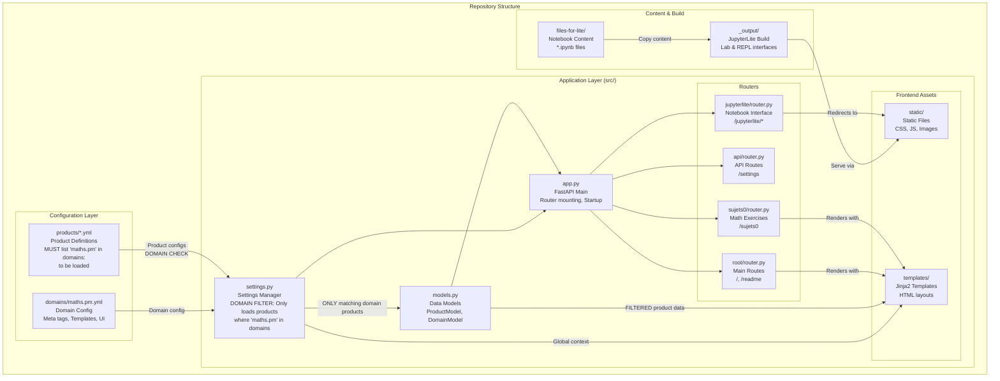

# 📚 Maths.pm - FastAPI Application

A **FastAPI-powered application** for Maths.pm educational resources with **JupyterLite integration** for interactive Python notebooks.

## 🚀 **Quick Start**

### **Install Dependencies**
```bash
pip install -r requirements.txt
```

### **Run the Application**

**Method 1: Uvicorn (Recommended)**
```bash
uvicorn src:app --host 0.0.0.0 --port 8000 --reload --log-level info
```

**Method 2: Python Module**
```bash
python -m src
```

**Server runs at: http://localhost:8000**

## 🔗 **All Available Routes & Views**

### 📋 **Main Application**
- **`/`** - Homepage displaying all educational products and resources
- **`/readme`** - Documentation page displaying this README with beautiful DaisyUI prose styling
- **`/api/products`** - JSON API returning all available products
- **`/api/health`** - Application health check and status

### 🎯 **Educational Tools**
- **`/sujets0`** - Interactive mathematics question generator for French "Sujets 0" exams

### 🔬 **JupyterLite Views** *(The Complete Suite)*

#### **Primary Interfaces**
- **`/jupyterlite/`** - Smart entry point (auto-redirects to Lab)
- **`/jupyterlite/lab`** - **Full Jupyter Lab** - Complete notebook environment with file browser, extensions, multiple tabs
- **`/jupyterlite/repl`** - **Python REPL** - Interactive console for quick code execution and learning
- **`/jupyterlite/embed`** - **Demo Page** - Shows both Lab and REPL side-by-side for comparison

#### **Specialized Views**
- **`/jupyterlite/sandbox/repl`** - Clean, full-screen REPL interface (perfect for embedding)

#### **Backward Compatibility** *(Your Old Links Still Work)*
- **`/jupyter`** - Redirects to `/jupyterlite/lab` (permanent redirect)
- **`/jupyter/repl`** - Redirects to `/jupyterlite/repl` (permanent redirect)

#### **Direct Static Access** *(For Advanced Users)*
- **`/static/jupyterlite/_output/lab/index.html`** - Direct Lab access
- **`/static/jupyterlite/_output/repl/index.html`** - Direct REPL access

### 📁 **Static Assets**
- **`/static/`** - CSS, JavaScript, images, and other static files

## 📚 **JupyterLite Integration Details**

**JupyterLite is enabled by default** and provides:
- 🐍 **Python notebooks** running entirely in the browser
- 📊 **Scientific libraries**: NumPy, Matplotlib, SymPy
- 🔬 **Interactive mathematics** education environment
- 🚀 **No server required** - runs on Pyodide/WebAssembly
- 🎨 **Multiple interfaces** for different use cases

### **When to Use Each JupyterLite View:**

| View | Best For | Use Case |
|------|----------|----------|
| **Lab** | Data science, complex projects | Full notebook development, multiple files |
| **REPL** | Quick calculations, learning | Testing code snippets, math homework |
| **Embed** | Demonstrations, comparisons | Showing capabilities to new users |
| **Sandbox REPL** | Clean embedding | Integration into other websites |

**Disable JupyterLite:**
```bash
export JUPYTERLITE_ENABLED=false
uvicorn src:app --host 0.0.0.0 --port 8000 --reload --log-level info
```

## 🧪 **Testing All Views**

Start your server and try these links:

```bash
# Start the server
uvicorn src:app --host 0.0.0.0 --port 8000 --reload

# Main application
curl http://localhost:8000/                    # Homepage
curl http://localhost:8000/api/products        # Products API
curl http://localhost:8000/api/health          # Health check

# Documentation
# Visit: http://localhost:8000/readme          # Beautiful README view

# Educational tools
# Visit: http://localhost:8000/sujets0         # Math exercises

# JupyterLite views (visit in browser)
# http://localhost:8000/jupyterlite/lab        # Full Lab
# http://localhost:8000/jupyterlite/repl       # REPL console
# http://localhost:8000/jupyterlite/embed      # Demo page
# http://localhost:8000/jupyter                # Old link (redirects)
```

## 📁 **Project Structure & Architecture**

The application follows a **configuration-driven architecture** where YAML files define the behavior and content, while the Python code provides the framework:



### **Key Architecture Concepts:**

#### **🌐 Configuration Layer**
- **`domains/maths.pm.yml`**: Domain-wide settings (meta tags, templates, branding)
- **`products/*.yml`**: Individual service definitions with backend settings
- **Domain filtering**: Products are loaded only if they match the current domain

#### **⚙️ Application Layer** 
- **`settings.py`**: Central configuration manager that loads and validates YAML configs
- **`models.py`**: Pydantic models for type-safe configuration handling
- **`app.py`**: FastAPI application with modular router architecture

#### **🛣️ Router Organization**
- **Modular routers**: Each feature has its own router (root, api, sujets0, jupyterlite)
- **Conditional mounting**: JupyterLite router only loads if enabled
- **Backward compatibility**: Old `/jupyter` routes redirect to new `/jupyterlite` routes

#### **📚 Content Pipeline**
- **`files-for-lite/`**: Source notebooks and content
- **`_output/`**: JupyterLite build artifacts (generated at startup)
- **`static/`**: Served assets including the built JupyterLite interface

### **Directory Structure:**
```
pca-mathspm/
├── domains/                # 🌐 Domain configurations
│   └── maths.pm.yml        # Domain-specific settings
├── products/               # 📦 Product definitions  
│   ├── 01_nagini.yml       # Python-in-browser tool
│   ├── 02_jupyterlite.yml  # Notebook environment
│   ├── 14_sujets0.yml      # Math exercise generator
│   └── ...                 # More products
├── src/                    # ⚙️ Application code
│   ├── api/                # 🔌 JSON API routes
│   ├── jupyterlite/        # 🔬 Notebook interface routes
│   ├── sujets0/            # 📚 Math exercise routes  
│   ├── root/               # 🏠 Main page routes
│   ├── static/             # 📁 CSS, JS, images
│   ├── templates/          # 📄 Jinja2 HTML templates
│   ├── app.py              # 🚀 FastAPI application
│   ├── settings.py         # ⚙️ Configuration manager
│   └── models.py           # 📋 Data models
├── files-for-lite/         # 📓 Notebook source content
└── _output/                # 🏗️ JupyterLite build (generated)
```

## 🛠️ **Development**

**Auto-reload is enabled** - the server watches for changes in Python files, YAML configurations, and templates.

**Health Check:**
```bash
curl http://localhost:8000/api/health
```
```json
{
  "status": "healthy",
  "products_loaded": 6,
  "version": "0.1.0",
  "jupyterlite_enabled": true,
  "domain": "maths.pm"
}
```

## 🎯 **Key Features**

- ✅ **Modern FastAPI** with async support and organized router architecture
- ✅ **Complete JupyterLite suite** with 5 different views for various use cases
- ✅ **Backward compatibility** - old links continue to work
- ✅ **Educational focus** - specialized tools for mathematics education
- ✅ **Strict configuration** with strictyaml validation
- ✅ **Server-side rendering** with Jinja2 templates
- ✅ **Hot reload** for rapid development
- ✅ **Conditional features** - disable components as needed

## 🎓 **Educational Use Cases**

### **For Teachers:**
- Use `/jupyterlite/embed` to demonstrate both interfaces to students
- Start beginners with `/jupyterlite/repl` (less overwhelming)
- Graduate advanced students to `/jupyterlite/lab` (more powerful)
- Use `/sujets0` for French mathematics exam preparation

### **For Students:**
- **Homework**: Use REPL for quick calculations and verification
- **Projects**: Use Lab for complex data analysis and visualization
- **Learning**: Progress from REPL → Lab as skills develop

### **For Integration:**
- **Website embedding**: Use sandbox views for clean integration
- **Demonstrations**: Use embed view to showcase capabilities
- **Direct access**: Link to specific Lab or REPL as needed

---

**Built with FastAPI + JupyterLite + strictyaml** 🚀
