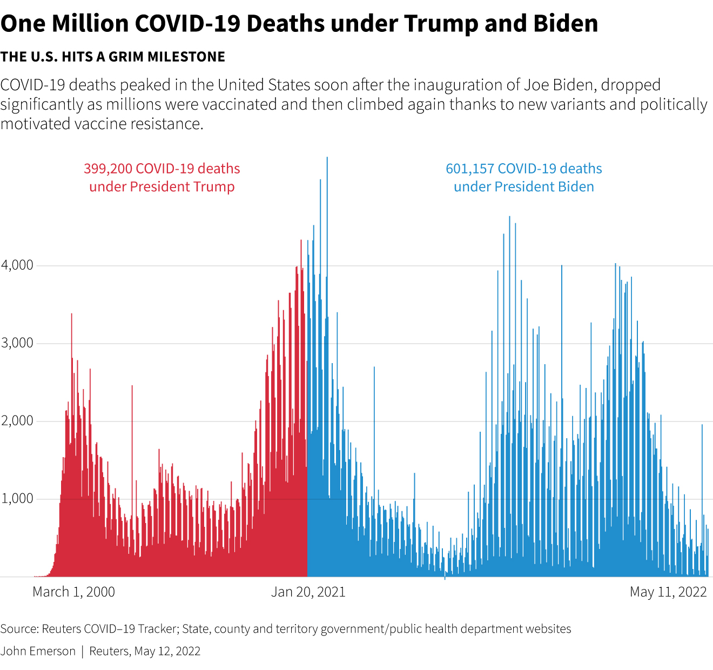

# Organizational aspects, syllabus and evaluation criteria

## A first example from Reuters

[TOC]

> Can we make bold statements about the time-series of numbers of COVID-19 deaths in the US? Do we need more data? The complete article from **Reuters** is available [here](https://www.reuters.com/world/us/biden-marks-1-million-americans-dead-covid-2022-05-12/).
To better understand this chart and the conclusion we can draw, more details are provided [here](80_covid_us_stats_analysis.md).

## About this course

### 📝 Organizational details

- Teaching Language: English  
- ECTS Credits: 1  
- Duration: 
    - 15 hours lectures and tutorials (i.e. $3\\times 5h= 15h$)
    - 10 hours personal work  
- Teaching material: [*See below*](#detailed-plan-and-organization-of-the-course)
    - *"Slides"*
    - Exercises

### ✅ Prerequisites

- Basics on Python
- (secondary) Fundamental statistics and mathematics
- (secondary) Understanding of data structures (mostly `numpy.arrays`, `pandas.DataFrames`)

**These two secondary aspects will be presented in the course, but not covered in depth.**

### 🛠️ Technologies used in this course

**Software:** Python 

**Focus on the libraries:**

- Matplotlib
- Bokeh

### 📊 Learning Outcomes

- Notions in graphic semiology to be able to choose the relevant visualization. 
- Creation of interactive diagrams, cartographic or otherwise, to represent datasets, in Python.

### 🎯 Subjects Covered

> Data visualization is a fundamental ingredient of data science as it "forces us to notice what we never expected to see" in a given dataset. Dataviz is also a tool for communication and, as such, is a visual language. Throughout the course, we will focus on methods and strategies to represent datasets, using dynamic and interactive tools.

<!-- 
**📖 Course Materials:**
- **[Introduction & Interactive Notebooks](01_introduction.md)** - Getting started with Jupyter environments and code fragments
- **[Jupyter Launcher](jupyter_launcher.md)** - Direct access to interactive Python environments -->

&nbsp;

### 📝 Evaluation
The evaluation consists of a data visualization project. The students will have *to build a website* based on Bokeh library. As this course doesn't include any web development concepts and tools, the students will have the right to use a `Jupyter Notebook`. Hence, Bokeh interactivity will be available in the notebook format.
