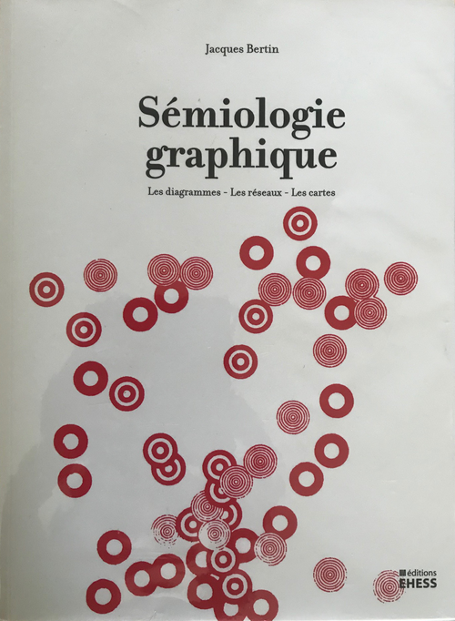
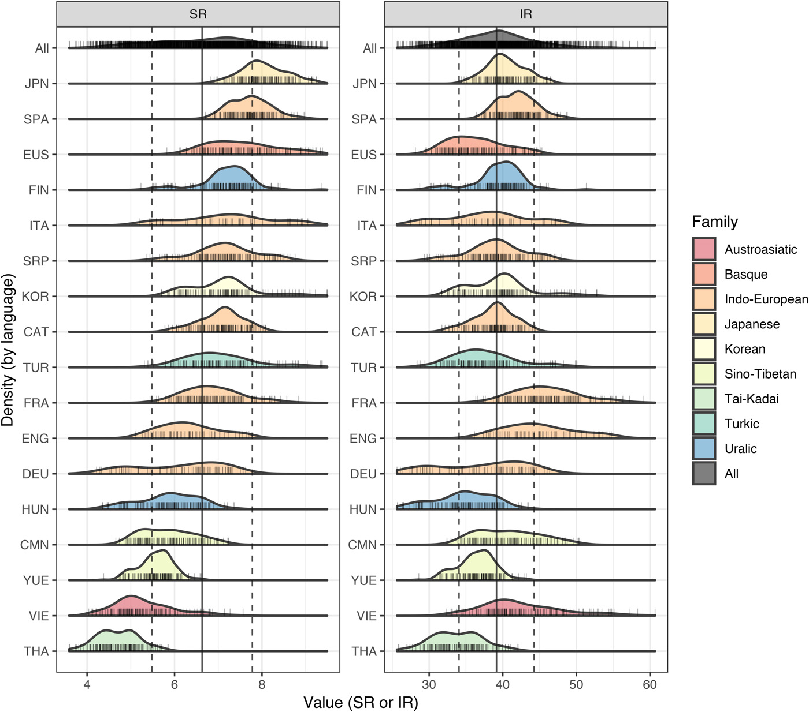
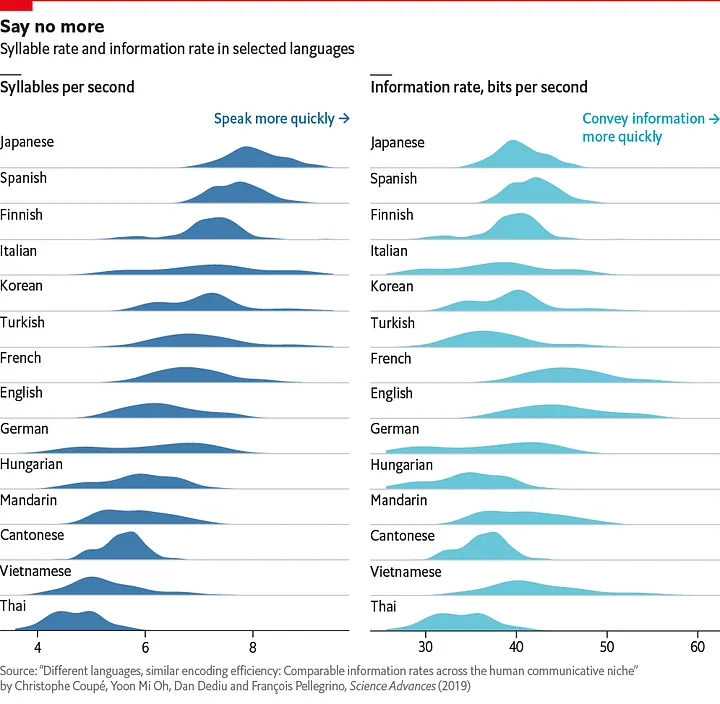

# Graphic Semiology Fundamentals


[TOC]

## Introduction to Graphic Semiology

*Graphic semiology studies how visual elements act as a language to encode, communicate, and process information. Pioneered by Jacques Bertin, it formalizes the grammar of graphics: how visual variables (symbols, signs, marks) represent data in diagrams, maps, and networks. Bertin’s thesis is that graphics constitute a system with its own syntax and semantics, much as in verbal language.*



{: .max-w-[400px] .mx-auto}


<!-- Sémiologie graphique de Jacques Bertin, Réédition EHESS 2013
[Source: Wikipedia - Licence CC 4.0](https://commons.wikimedia.org/wiki/File:Bertin_semiologie-graphique.png) -->


<!-- For more details, see: 

- [1](#source-1)
- [4](#source-4)
- [5](#source-5)
- [6](#source-6) -->

## 1. Theoretical Foundations

### 1.1. Graphics as Language

- Graphics are a visual code, and each constructed image is a message.
- Visual elements (the signifiers) correspond to information components (the signified).
- The goal is to achieve “visual unity,” maximizing both efficiency and global apprehension of a message.


### 1.2. A first example from [this research paper](https://www.science.org/doi/10.1126/sciadv.aaw2594)


This graph comes from the research paper: *Different languages, similar encoding efficiency: Comparable information rates across the human communicative niche* by Christophe Coupé, Yoon Mi Oh, Dan Dediu, and François Pellegrino.<br>[Source: Science.org](https://www.science.org/doi/10.1126/sciadv.aaw2594)



{: .max-w-[550px] .mx-auto .my-6}


### 1.3. [An adapation](https://www.economist.com/graphic-detail/2019/09/28/why-are-some-languages-spoken-faster-than-others) of this graph from The Economist


This graph comes from the article: *Why are some languages spoken faster than others?* [by The Economist](https://www.economist.com/graphic-detail/2019/09/28/why-are-some-languages-spoken-faster-than-others) (Sep 28th 2019).


{: .max-w-[550px] .mx-auto .my-6}


### 1.4. Discussion

- What are the signifiers ?
- What are the signified ?
- What can we conclude from those graphs ?
- How to they compare in terms of visual unity ?


### 1.5. Historical Evolution

- Bertin's laboratory, the Laboratoire de Graphique, crystallized these principles through interdisciplinary collaboration, handling demands across social sciences, geography, and cartography.
- The 1967 *“Sémiologie graphique”* was a paradigm shift, bringing a rational, systematic language for visual analytics.


## 2. Information Analysis

### 2.1. Structure of Information

### 2.1.1. Invariant and Components

- **Invariant (Theme/Essence):** The unifying core of the data (e.g., a common subject or theme linking all data points).
- **Components (Variables/Items):** Distinct fields or characteristics in the dataset (nominal, ordinal, quantitative).
- Components can relate differentially (qualitative categories), ordinally (rank/order), or quantitatively (measured scales).


### 2.1.2. An example with a bar chart


```yaml
f_type: "codex_"
height_in_px: 800
inline: |
    import matplotlib.pyplot as plt

    # Real data: World's tallest buildings over 500m
    # INVARIANT: Buildings (the theme)

    # Raw data lists - all buildings over 500m
    buildings = ['Burj Khalifa', 'Merdeka 118', 'Shanghai Tower', 'Abraj Al-Bait', 'Ping An']
    heights = [828, 679, 632, 601, 599]  # meters
    cities = ['Dubai', 'Kuala Lumpur', 'Shanghai', 'Mecca', 'Shenzhen']
    completion_years = [2010, 2023, 2015, 2012, 2017]

    # Sort by year for proper x-axis
    sorted_data = sorted(zip(completion_years, buildings, heights, cities))
    years_sorted = [item[0] for item in sorted_data]
    buildings_sorted = [item[1] for item in sorted_data]
    heights_sorted = [item[2] for item in sorted_data]
    cities_sorted = [item[3] for item in sorted_data]

    # Simple bar chart with greys and narrower bars
    plt.figure(figsize=(14, 8))
    colors = ['#2C3E50', '#34495E', '#5D6D7E', '#85929E', '#AEB6BF']  # Different shades of grey
    bars = plt.bar(years_sorted, heights_sorted, width=1, color=colors, alpha=0.9, 
                edgecolor='black', linewidth=2)

    # Add building names and cities above bars
    for i, (bar, building, city) in enumerate(zip(bars, buildings_sorted, cities_sorted)):
        # Building name
        plt.text(bar.get_x() + bar.get_width()/2, bar.get_height() + 25, 
                building, ha='center', va='bottom', fontsize=12, fontweight='bold')
        # City name in italics
        plt.text(bar.get_x() + bar.get_width()/2, bar.get_height() + 45, 
                city, ha='center', va='bottom', fontsize=11, style='italic')

    # X-axis with actual years as x values
    all_years = list(range(2010, 2024))
    plt.xticks(all_years, fontsize=10, rotation=45)
    plt.xlabel('Completion Year', fontsize=13)
    plt.ylabel('Height (meters)', fontsize=13)
    plt.title('STRUCTURE: Invariant + Components\nInvariant: Buildings | Components: Name (nominal), Height (quantitative), City (nominal), Year (quantitative)', 
         fontsize=18, pad=25, fontweight='bold')

    plt.ylim(0, max(heights_sorted) + 80)  # Extra space for labels
    plt.tight_layout()
    plt.show()
```


### 2.2. Relationships

#### 2.2.1. Relations and dimensionality

- Key in analysis: how components relate, not necessarily their individual meanings, but their differences and connections.
- For every dataset, determining its dimensionality (number/nature of components) directs the choice of graphic strategy.


#### 2.2.2. An example with a scatter plot (+ regression line)

```yaml
f_type: "codex_"
inline: |

    import matplotlib.pyplot as plt
    import numpy as np

    # Real data: Olympic 100m sprint records
    # INVARIANT: Athletic performance (the theme)

    # Raw data lists - men's 100m world records progression
    years = [1912, 1921, 1930, 1936, 1956, 1968, 1977, 1983, 1988, 1994, 1999, 2005, 2007, 2008, 2009]
    times = [10.6, 10.4, 10.3, 10.2, 10.1, 9.95, 9.95, 9.93, 9.92, 9.85, 9.79, 9.77, 9.74, 9.69, 9.58]  # seconds
    record_holders = ['USA', 'USA', 'CAN', 'USA', 'USA', 'USA', 'USA', 'USA', 'CAN', 'USA', 'USA', 'JAM', 'JAM', 'JAM', 'JAM']

    # Create scatter plot
    plt.figure(figsize=(12, 8))

    # Different colors for different countries
    country_colors = {'USA': '#1f77b4', 'CAN': '#ff7f0e', 'JAM': '#2ca02c'}
    colors = [country_colors[country] for country in record_holders]

    # Scatter plot
    plt.scatter(years, times, c=colors, s=80, alpha=0.8, edgecolor='black', linewidth=1.5)

    # Add regression line
    z = np.polyfit(years, times, 1)
    p = np.poly1d(z)
    plt.plot(years, p(years), "r--", alpha=0.8, linewidth=2, label=f'Trend: {z[0]:.4f}s per year')

    # Labels and formatting
    plt.xlabel('Year', fontsize=13)
    plt.ylabel('Time (seconds)', fontsize=13)
    plt.title('RELATIONSHIPS: How Components Connect\nInvariant: Athletic Performance | Relationship: Time vs Technology/Training Evolution', 
            fontsize=16, pad=20, fontweight='bold')

    # Invert y-axis (faster times are lower)
    plt.gca().invert_yaxis()

    # Add legend for countries
    for country, color in country_colors.items():
        plt.scatter([], [], c=color, s=80, label=country, edgecolor='black')
    plt.legend(loc='upper right', fontsize=11)

    # Grid for better readability
    plt.grid(True, alpha=0.3)
    plt.tight_layout()
    plt.show()
```

***

## 3. Graphic System: Theoretical Framework

### 3.1. Plane and Space

- The cartographic/graphic “plane” is the two-dimensional space in which elements are organized.[8]
- It translates “plane geometry” into meaningful arrangements: quantities, categories, relationships, or spatial representations.[8]

### 3.2. Classes of Representation

- **Diagrams:** Abstract data structures (e.g., time series, bar charts).[6]
- **Networks:** Relationships among entities (e.g., graphs, flow diagrams).[6]
- **Maps:** Spatial embedding of data (e.g., geographic maps).[6][5]

***

## 4. Visual (Retinal) Variables

### 4.1. The Eight Visual Variables

Bertin identifies eight key visual variables used to encode data in 2D graphics:[6][5]

| Variable     | Description                          | Example Use                        |
| ------------ | ------------------------------------ | ---------------------------------- |
| Position     | X/Y coordinates                      | Maps, scatter plots                |
| Size         | Magnitude (length, area, volume)     | Bubble charts                      |
| Value        | Lightness/darkness                   | Heatmaps, shading                  |
| Texture      | Pattern density                      | Map hatching                       |
| Color (Hue)  | Color spectrum distinction           | Categorical maps/charts            |
| Orientation  | Angle/direction                      | Wind maps, texture direction       |
| Shape        | Icon/form                            | Markers, diagram symbols           |
| Grain        | Fineness or coarseness of texture    | (Often non-standard, overlaps above)|

> {{matplotlib_placeholder_visual_variables}}

### 4.2. Properties of Visual Variables[7][5]

- **Selectivity:** Can similar symbols be rapidly and preattentively recognized?
- **Associativity:** Can variables be grouped and compared without interference from others?
- **Order:** Can the variable sensibly convey progression or ranking?
- **Quantification:** Can the variable indicate measurable differences?

Associativity is crucial for design: some variables interfere with others (disassociativity), making layering complex data less clear.[7]

***

## 5. Graphic Rules and Grammar

### 5.1. Problem Construction

- Any graphic is a solution to multiple possible ways to encode the same dataset—the “graphic problem” is to choose the most efficient/legible.[1][6]
- Design must account for perceptual tasks (lookup, comparison, grouping, pattern search).[3][5]

### 5.2. Grammar of Construction

- **Density:** Avoid excessive clutter, but enough detail for insight.[10][1]
- **Retinal Legibility:** Variables should combine without creating confusion.[3][8]
- **Layering/Separation:** Different elements must remain perceptually separable (via color, value, or shape).[5]

***

## 6. Reading Process and Perception

### 6.1. Pre-attentive Perception

- Visual variables support rapid, unconscious discovery of groupings and patterns.[7]
- “Selectivity” relates to perception: some variables (color, size) create instantly distinguishable groups, while others require sequential search.[7]

### 6.2. Cognitive Load

- Bertin aimed for graphics with the “least mental cost”: images readable at a glance, but acknowledged such universality ignores cultural/experiential differences.[5]

***

## 7. Functional Types of Graphics

### 7.1. Graphic Functions

- **Recording:** Visuals act as storage, often exhaustive and detailed.[1]
- **Communication:** Designed to highlight, simplify, persuade (editorial, presentations).[10][1]
- **Processing/Analysis:** Dynamic or interactive graphics for active reasoning, including the “mobile” Bertin Matrix for pattern-finding.[5]

> {{matplotlib_placeholder_functional_types}}

***

## 8. Application Examples

### 8.1. Diagrammatic Uses

- Bar/line charts for temporal or categorical progression.
- Matrices for comparing variables and uncovering structure (e.g., Bertin’s reorderable matrices).[5]

### 8.2. Network Uses

- Force-directed graphs for social/political ties.
- Flow diagrams for process and logistics.

### 8.3. Spatial Use (Maps)

- Thematic maps using hue or texture for data distribution.
- “Image-file” arrangements for sorting and exploring spatial patterns.[5]

> {{matplotlib_placeholder_application_examples}}

***

## 9. Semiotic Theory in Graphics

### 9.1. Signs and Meaning

- **Signifier:** Visual mark/symbol.[11][5]
- **Signified:** The concept/data represented.[11][5]
- Literal (denotation) and cultural/contextual (connotation) meaning may differ.[12][11][5]

### 9.2. Category of Signs

- **Icon:** Resemblance (e.g., shape of a tree for a forest).
- **Index:** Causality/association (e.g., thermometer icon for temperature).
- **Symbol:** Arbitrary or conventional representation (e.g., blue for water).[11]

***

## 10. Critique and Evolution

- Bertin’s work is foundational, yet some properties such as cognitive differences and cultural bias were underexplored.[5]
- Later work in visual analytics, user-centric/cultural semiotics, and digital technology broaden the grammar Bertin established.[3][5]

***

## Placeholders for Matplotlib Visualizations

- {{matplotlib_placeholder_information_structure}}
- {{matplotlib_placeholder_visual_variables}}
- {{matplotlib_placeholder_functional_types}}
- {{matplotlib_placeholder_application_examples}}

***

## References

**Jacques Bertin - Semiology of Graphics: Diagrams, Networks, Maps** (1967/2010)
{: #source-1}
<br>The foundational work that established graphic semiology as a systematic approach to visual information design. Bertin's comprehensive treatise on how visual variables encode data meaning.

**Nicolas Kruchten - Interactive Exploration of Bertin's Semiology of Graphics**
{: #source-2}
<br>Modern interactive interpretation and exploration of Bertin's principles, demonstrating their continued relevance in digital visualization.

**InformationVisuals.com - Jacques Bertin's Semiology of Graphics**
{: #source-3}
<br>Contemporary analysis and explanation of Bertin's theoretical framework, making his concepts accessible to modern designers and data analysts.

**St. Mary's College Archive - Jacques Bertin: Semiology of Graphics**
{: #source-4}
<br>Academic archive containing Bertin's work on graphics as a language system, exploring the linguistic properties of visual communication.

**Hypergeo/EHESS - Jacques Bertin Biography and Theory**
{: #source-5}
<br>Comprehensive biographical and theoretical overview from the École des Hautes Études en Sciences Sociales, detailing Bertin's contributions to geographic and graphic sciences.

**History of Information - Bertin's Visual Variables**
{: #source-6}
<br>Historical documentation of Bertin's eight visual variables and their impact on information design methodology.

**International Cartographic Association - Associativity and Disassociativity of Visual Variables**
{: #source-7}
<br>Reimer's analysis of how visual variables interact, focusing on the crucial concept of associativity in multi-variable graphic design.

**Digital Society School - Bertin Semiology of Graphics Excerpt**
{: #source-8}
<br>Educational excerpt focusing on the practical applications of Bertin's plane geometry concepts in contemporary design.

**Anthony Masure - From Semiology of Graphics to Cultural Analytics**
{: #source-9}
<br>Modern interpretation connecting Bertin's foundational work to contemporary cultural analytics and digital humanities approaches.

**ESRI Press - Semiology of Graphics Sample Pages**
{: #source-10}
<br>Publishing sample demonstrating practical applications of Bertin's principles in geographic information systems and cartographic design.

**Squarespace Archive - Semiotics and Graphic Design**
{: #source-11}
<br>Resource on the broader semiotic foundations underlying graphic design, extending beyond Bertin's specific contributions.

**Aiello, G. - Visual Semiotics: Key Concepts and New Directions (2020)**
{: #source-12}
<br>Contemporary academic analysis published in The SAGE Handbook of Visual Research Methods, updating semiotic theory for modern visual research.

***

All structure, distinctions, and categories directly referenced from leading analyses and primary sources on graphic semiology, ready for highly detailed study or code-linked illustration.