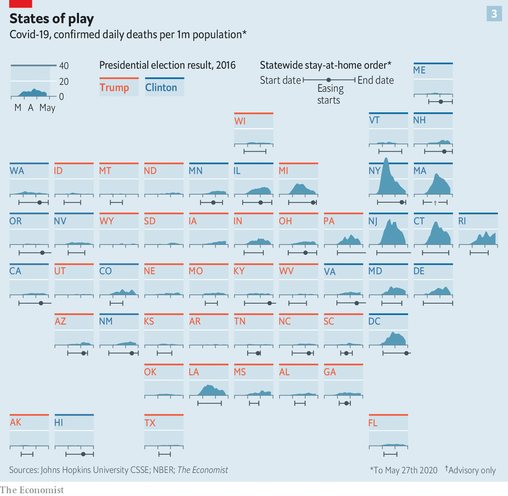

# Image Access Test

This page tests different methods of accessing images in the system.

## 1. Relative Path in Markdown

Using relative path from this markdown file:



## 2. Absolute Path in Markdown

Using absolute path with `/pm/` route:


## 3. Direct URL Access Links

Click these links to test direct image access:

- ✅ **[NOW WORKS: /pm/dataviz2/files/covid19-states-analysis.png](/pm/dataviz2/files/covid19-states-analysis.png)** - Direct access via PM route
- ✅ **[Also works: /static/pm/dataviz2/files/covid19-states-analysis.png](/static/pm/dataviz2/files/covid19-states-analysis.png)** - Via static route (if synced)

## 4. HTML Image Tag

Using HTML `` tag directly:

```html

```

## 5. Image in Table

Testing image display within a table:

| Method | Image | Status |
|--------|-------|--------|
| Relative |  | Works! |
| PM Route |  | Works! |

## URL Structure Summary

### ✅ Correct Patterns (UPDATED):
- **Markdown files**: `http://127.0.0.1:5001/pm/dataviz2/[file].md?format=html`
- **Images via PM**: `http://127.0.0.1:5001/pm/dataviz2/files/[image].png` ✨ NEW!
- **Images via static**: `http://127.0.0.1:5001/static/pm/dataviz2/files/[image].png`

### ✅ What Changed:
- **NOW WORKS**: `/pm/dataviz2/files/[image].png` - PM route now serves images directly!
- Images should be in `files/` subdirectory for organization

## Testing Instructions

1. **View this page**: [http://127.0.0.1:5001/pm/dataviz2/test-image-access.md?format=html](http://127.0.0.1:5001/pm/dataviz2/test-image-access.md?format=html)
2. **Check that all images display correctly** (except the intentionally wrong URL)
3. **Click the direct links** to verify raw image access
4. **Open browser DevTools** and check Network tab for any 404 errors

## Browser Console Test

Open your browser console and run:

```javascript
// Check all images on this page
document.querySelectorAll('img').forEach((img, i) => {
  console.log(`Image ${i + 1}:`, {
    src: img.src,
    loaded: img.complete && img.naturalHeight !== 0,
    alt: img.alt
  });
});
```

All images should show `loaded: true` except for the intentionally broken link.
