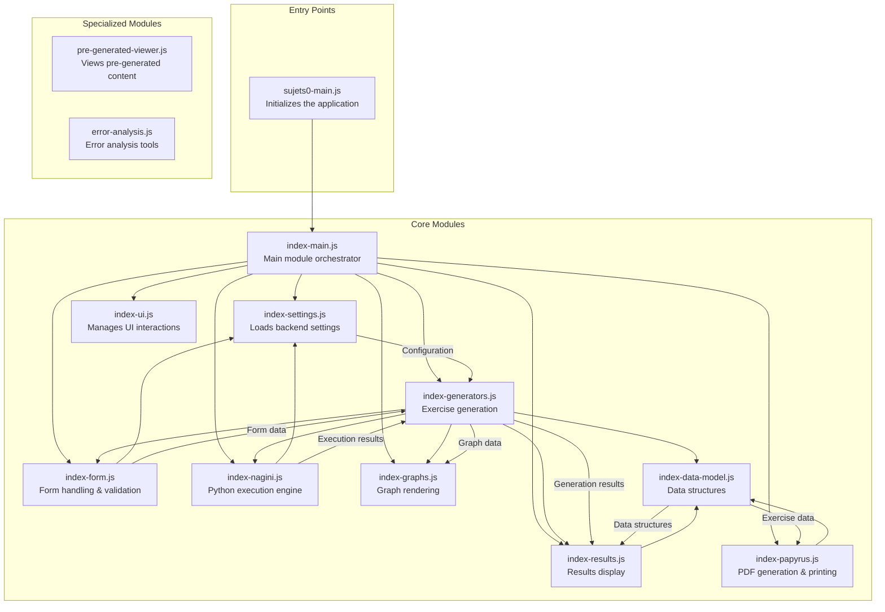

# Sujets0 JavaScript Architecture

This document explains the architecture of the JavaScript modules used in the Sujets0 exercise generator page.

## Architecture Overview

The Sujets0 exercise generator consists of multiple JavaScript modules that work together to:
1. Handle form inputs and validation
2. Connect to the Python execution engine (Nagini)
3. Generate mathematical exercises
4. Display results and graphs

## Module Relationships

## Module Descriptions

### Entry Points
- **sujets0-main.js**: The entry point that initializes the application and loads the main module.

### Core Modules
- **index-main.js**: The main orchestrator that imports and initializes all other modules.
- **index-settings.js**: Loads and processes backend settings and configuration.
- **index-ui.js**: Manages UI interactions, tab switching, and display states.
- **index-form.js**: Handles form data extraction, validation, and provides configuration for generators.
- **index-nagini.js**: Integrates with Nagini for Python code execution.
- **index-generators.js**: Manages the execution of exercise generators and processes results.
- **index-results.js**: Handles the display of generated exercise results, including pagination.
- **index-graphs.js**: Builds and renders mathematical graphs for visualizations.
- **index-data-model.js**: Defines data structures for storing generator results.
- **index-papyrus.js**: Transforms exercise data into Papyrus JSON format for PDF generation and printing.

### Specialized Modules
- **pre-generated-viewer.js**: Tool for viewing pre-generated content.
- **error-analysis.js**: Tools for analyzing and displaying errors.

## Data Flow

1. The user fills out the form with configuration parameters.
2. When the form is submitted, the `index-form.js` module validates the inputs and creates a configuration object.
3. The `index-generators.js` module uses this configuration to execute generators through Nagini.
4. Nagini executes the Python code for each generator and returns the results.
5. The `index-results.js` module displays the generation results.
6. If needed, the `index-graphs.js` module renders mathematical visualizations.

## Recent UI Improvements

Recent changes to the UI include:
- Removing the "Journal de session" section
- Adding a persistent status message with a progress bar
- Displaying detailed results in a collapsible section
