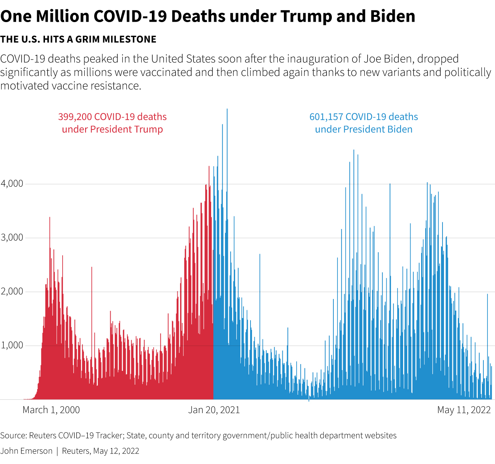

# Data Visualization 


[TOC]

Plan: organizational aspects, syllabus and evaluation
{: .pm-subtitle}


<hr class="my-5 border-base-200">


###  An example of data visualization

> Can we make bold statements about the time-series of COVID-19 of numbers of deaths in the US ? Do we need more data to be sure ? This will be exercise 1.




The complete article from **Reuters** is available [here](https://www.reuters.com/world/us/biden-marks-1-million-americans-dead-covid-2022-05-12/). Some more details are available [here](80_covid_us_stats_analysis.md).


## About this course


### 📝 Organizational details

**Teaching Language:** English  
**ECTS Credits:** 1  
**Duration:** 

- 15 hours lectures and tutorials (i.e. $3\\times 5h= 15h$)
- 10 hours personal work  

**Teaching material: *(more details below)***

- *"Slides"*
- Exercises


### ✅ Prerequisites

- Basics on Python
- (secondary) Fundamental statistics and mathematics
- (secondary) Understanding of data structures (mostly `numpy.arrays`, `pandas.DataFrames`)

**Those two secondary aspects will be presented in the course, but not covered in depth.**


### 🛠️ Technologies used in this course


**Software:** Python 

**Focus on the libraries:**

- Matplotlib
- Bokeh


### 📊 Learning Outcomes

- Notions in graphic semiology to be able to choose the relevant vizualisation. 
- Creation of interactive diagrams, cartographic or otherwise, to represent datasets, in Python.


### 🎯 Subjects Covered

> Data visualization is a fundamental ingredient of data science as it “forces us to notice what we never expected to see” in a given dataset. Dataviz is also a tool for communication and, as such, is a visual language. All along the courses, we will focus on methods and strategies to represent datasets, using dynamic and interactive tools.


<!-- 
**📖 Course Materials:**
- **[Introduction & Interactive Notebooks](01_introduction.md)** - Getting started with Jupyter environments and code fragments
- **[Jupyter Launcher](jupyter_launcher.md)** - Direct access to interactive Python environments -->

### 📝 Evaluation
The evaluation consists on a data vizualisation project. The students will have *to build a web site* based on Bokeh library. As this course doesn't include any web development concepts and tools, the student will have will have the right to use a `Jupyter Notebook`. Hence, bokeh interactivity will be avalaible


## 5 × 3-hours sessions

### 1️⃣ **Session 1: Foundations & Graphic Semiology (3 hours)**

#### **Hour 1: Course Introduction & Visual Variables**

[**Course overview and evaluation criteria (i.e. the file you're currently reading)**](00_plan.md)
**[Graphic Semiology Fundamentals](01_session_1_h_1.md)**
<br>
<!-- - Mostly based on Jacques Bertin's work -->
<!-- - Visual variables: position, size, shape, value, color, orientation, texture
- Mapping data types to visual channels
- Perceptual mathematics: Weber-Fechner law, Stevens' power law -->

#### **Hours 2-3: Data Types & Chart Taxonomy**
[**Data Types Classification and introduction to `matplotlib`**](01_session_1_h_23.md)

<!-- - Nominal, ordinal, quantitative data
- Temporal, spatial, hierarchical, network data
- Multivariate and high-dimensional data -->

<!-- **Mathematical Foundations:**
- Coordinate systems (Cartesian, polar, logarithmic)
- Statistical distributions and their visual representations -->

**Complete Chart Types Taxonomy** *(Ordered easiest to most complex)*

**1. Ranking & Comparison** *(Easiest - Basic aggregations)*
- Bar plots, lollipop charts, line plots, pie charts, doughnut charts
- *Mathematical basis: Basic arithmetic, percentages, sorting*

**2. Distribution Analysis** *(Easy - Statistical foundations)*
- Histograms, box plots, density plots, violin plots, ridgeline plots
- *Mathematical basis: Descriptive statistics, quartile calculations, kernel density estimation*

**3. Correlation & Relationships** *(Moderate - Bivariate analysis)*
- Scatter plots, bubble plots, heatmaps, connected scatter plots, correlograms, 2D density plots
- *Mathematical basis: Correlation coefficients, regression analysis*

**4. Evolution & Time Series** *(Moderate - Temporal complexity)*
- Area charts, stacked area charts, stream graphs
- *Mathematical basis: Time series analysis, smoothing algorithms*

**5. Part-of-Whole Relationships** *(Moderate-Advanced - Hierarchical structures)*
- Treemaps, circular packing, dendrograms
- *Mathematical basis: Hierarchical clustering, tree algorithms*

**6. Advanced Comparison & Multi-dimensional** *(Advanced - Complex encodings)*
- Spider/radar charts, parallel coordinates, circular bar plots, word clouds
- *Mathematical basis: Normalization techniques, dimensionality reduction*

**7. Spatial & Geographic** *(Advanced - Coordinate systems)*
- Geographic scatter, choropleth maps, hexbin maps, cartograms
- *Mathematical basis: Map projections, spatial statistics*

**8. Connections & Networks** *(Most Complex - Graph theory)*
- Flow diagrams, network graphs, arc diagrams, bubble maps, chord diagrams, Sankey diagrams, edge bundling
- *Mathematical basis: Graph theory, network analysis algorithms, force-directed layouts*

**Homework:** Review provided datasets, individual reflection on preferred dataset

---

### 2️⃣ **Session 2: Static Visualizations & Group Formation (3 hours)**

#### **Hour 1: Group Formation & Project Launch**
- **🎯 GROUP FORMATION** (3-4 students per group)
- Project requirements explanation
- Dataset selection by groups  
- Initial project planning (scope, objectives, deliverables)

#### **Hour 2: Matplotlib Foundations & Basic Charts**
**Statistical Graphics Principles** *(Following Tufte's principles)*
- Data-ink ratio optimization
- Chart junk elimination
- Small multiples principle

**Practice - Level 1 (Easiest Charts):**
- **Ranking & Comparison implementation**
  - Bar plots, line plots, pie charts, lollipop charts
  - **Code:** `02a_basic_charts.py`

#### **Hour 3: Distribution Analysis with Matplotlib**
**Practice - Level 2:**
- **Distribution visualization implementation**
  - Histograms, box plots, density plots, violin plots
  - Statistical foundations in practice
  - **Code:** `02b_distributions.py`

**Group Work:**
- Groups begin initial data exploration
- Apply basic charts and distributions to chosen dataset

---

### **Session 3: Correlations & First Presentations (3 hours)**

#### **Hours 1-2: Correlation & Relationship Analysis**
**Practice - Level 3 (Moderate complexity):**
- **Bivariate analysis implementation**
  - Scatter plots, bubble plots, heatmaps, correlation matrices
  - Connected scatter plots for temporal relationships
  - 2D density plots, correlograms
  - **Code:** `02c_correlations.py`

**Advanced Theory:**
- Correlation coefficients and statistical significance
- Regression analysis visualization
- Multi-dimensional relationship encoding

**Group Workshop:**
- Groups apply correlation analysis to their datasets
- Instructor consultations on visualization strategy

#### **Hour 3: First Group Presentations (1 hour)**
**🎤 GROUP PRESENTATIONS Round 1**
- **5 minutes per group**
- **Required Content:**
  - Chosen dataset description and context
  - Initial insights discovered through basic charts
  - Correlation analysis findings
  - Planned interactive visualization approach for final project
  - Technical challenges identified

**Evaluation Focus:** Data understanding, appropriate chart selection, visualization strategy

---

### **Session 4: Interactive Visualizations with Bokeh (3 hours)**

#### **Hour 1: Bokeh Foundations & Interaction Theory**
**Interactive Visualization Principles** *(Based on Shneiderman's work)*
- Overview first, zoom and filter, details on demand
- Direct manipulation principles
- Real-time data streaming concepts

**Bokeh Architecture:**
- From Matplotlib to Bokeh conversion strategies
- ColumnDataSource and data binding concepts
- Server vs. client-side interactivity trade-offs

#### **Hours 2-3: Comprehensive Bokeh Implementation**
**Basic Interactive Features:**
- Hover tools, zoom, pan, selection
- Interactive widgets: sliders, buttons, dropdowns, text inputs
- **Code:** `03a_bokeh_basics.py`

**Advanced Interactivity:**
- **Interactive Distribution Analysis**
  - Dynamic histograms with bin size controls
  - Interactive box plots with outlier filtering
  - Linked brushing for exploratory analysis
  - **Code:** `03b_interactive_distributions.py`

- **Advanced Correlation Tools**
  - Interactive scatter plots with regression lines
  - Dynamic correlation matrices with filtering
  - Multi-dimensional bubble charts with size/color controls
  - **Code:** `03c_interactive_correlations.py`

**CustomJS Implementation:**
- Client-side callbacks for animations
- JavaScript integration for complex interactions
- **Code:** `03d_customjs_examples.py`

**Group Project Intensive:**
- Groups convert their static visualizations to interactive Bokeh
- Individual consultations on technical implementation
- Web deployment preparation

---

### **Session 5: Advanced Visualizations & Final Presentations (3 hours)**

#### **Hour 1: Advanced Chart Types** *(Bonus Knowledge - Not Evaluated)*
**Level 4-8 Implementations** *(Quick overview for future reference)*

**Time Series & Evolution:**
- Interactive line plots with zoom/pan
- Stacked area charts, stream graphs
- **Code:** `04a_timeseries_advanced.py`

**Geographic & Spatial:**
- Interactive choropleth maps
- Geographic scatter with hover details
- Hexbin maps for density visualization
- **Code:** `04b_geographic_viz.py`

**Networks & Complex Relationships:**
- Interactive network diagrams
- Sankey diagram implementations
- Chord diagrams for relationship visualization
- **Code:** `04c_network_flows.py`

**Web Deployment Strategies:**
```python
# Primary Method: Static HTML Generation
from bokeh.plotting import figure, save, output_file
from bokeh.models import CustomJS, ColumnDataSource

# Create comprehensive interactive dashboard
def create_dashboard(data):
    p = figure(width=800, height=600, title="Interactive Data Dashboard")
    source = ColumnDataSource(data=data)
    
    # Multiple chart types integration
    scatter = p.circle('x', 'y', source=source, size=10, alpha=0.6)
    
    # Add interactivity with CustomJS
    callback = CustomJS(args=dict(source=source), code="""
        // Client-side interaction logic
        const data = source.data;
        // Update visualizations based on user input
        source.change.emit();
    """)
    
    return p

# Generate deployable HTML
output_file("final_project_dashboard.html")
save(create_dashboard(your_data))
```

#### **Hours 2-3: Final Group Presentations (2 hours)**
**🏆 FINAL PROJECT PRESENTATIONS**
- **10 minutes per group** (7 min presentation + 3 min Q&A)

**Comprehensive Evaluation Structure:**
1. **Dataset & Analytical Context** (2 min)
   - Data source, size, and domain explanation
   - Key analytical questions addressed

2. **Interactive Dashboard Demonstration** (4 min)
   - Live demonstration of deployed Bokeh website
   - Multiple chart types from course taxonomy
   - Interactive features: hover, zoom, selection, filtering
   - User experience walkthrough

3. **Insights & Data Storytelling** (1 min)
   - Key findings discovered through visualization
   - How interactivity revealed hidden patterns

4. **Technical Implementation** (Q&A - 3 min)
   - Code architecture explanation
   - Deployment strategy discussion
   - Challenges overcome

**Technical Requirements:**
- Functional Bokeh website (live URL + source code)
- Minimum 3 chart types from Sessions 1-4 content
- Interactive features: hover tools, widgets, or CustomJS callbacks
- Professional visual design following graphic semiology principles
- Deployed as static HTML (GitHub Pages, Netlify, etc.)

---

## 📝 Evaluation: Interactive Web Visualization Project

### **Project Timeline**
- **Session 1:** Individual dataset exploration
- **Session 2:** Group formation + dataset selection
- **Session 3:** First presentation (progress check)
- **Session 4:** Bokeh implementation work
- **Session 5:** Final presentation + submission

### **Deliverables**
1. **Working Bokeh website** (deployed as static HTML)
2. **Source code** with documentation
3. **Final presentation** (live demo)

### **Evaluation Criteria (100%)**
- **Technical Implementation** (40%)
  - Bokeh functionality and interactivity
  - Code quality and structure
  - Successful web deployment
  
- **Visualization Design** (30%)
  - Appropriate chart type selection (from course content)
  - Effective use of graphic semiology principles
  - Visual aesthetics and user experience
  
- **Data Analysis & Insights** (20%)
  - Dataset exploration depth
  - Meaningful insights discovered through visualization
  - Effective use of interactivity to reveal patterns
  
- **Presentation & Communication** (10%)
  - Clear demonstration of features
  - Professional presentation delivery

### **Deployment Method: Static HTML + Free Hosting**
**Recommended approach:**
1. Generate static HTML using Bokeh's `save()` function
2. Deploy to GitHub Pages, Netlify, or similar free hosting
3. Submit live URL for evaluation

**Why this approach:**
- ✅ Zero hosting cost
- ✅ Pure Python knowledge required
- ✅ Self-contained deliverable
- ✅ Works with basic Bokeh interactivity

---

## 🛠️ Technical Resources

### **Code Structure by Session**
```
course_materials/
├── session_01/
│   ├── slides_foundations.pdf
│   └── 01_basic_charts.py
├── session_02/
│   ├── slides_distributions.pdf
│   ├── 02_distributions.py
│   └── project_datasets/
├── session_03/
│   ├── slides_correlations.pdf
│   ├── 02_correlations.py
│   └── presentation_guidelines.md
├── session_04/
│   ├── slides_bokeh.pdf
│   ├── 03_bokeh_basics.py
│   ├── 03_bokeh_interactive.py
│   └── deployment_guide.md
└── session_05/
    ├── 04_advanced_charts.py
    └── final_presentation_rubric.md
```

### **Required Libraries**
```python
# requirements.txt
matplotlib>=3.5.0
bokeh>=2.4.0
pandas>=1.3.0
numpy>=1.21.0
```

---

## 📚 Bibliography
1. **Official Python documentation:** https://docs.python.org/
2. **Matplotlib:** https://matplotlib.org/
3. **Bokeh documentation:** https://docs.bokeh.org/en/latest/

---

## 🎯 Session Focus Summary

| Session | Focus | Group Work |
|---------|--------|------------|
| **1** | Foundations + Basic charts | Individual dataset exploration |
| **2** | **Group formation** + Distributions | Groups select dataset & scope |
| **3** | Correlations + **First presentations** | Groups present progress (1h) |
| **4** | Bokeh interactivity | Groups implement final project |
| **5** | Advanced topics + **Final presentations** | Final demos (2h) |

**Key Timing:**
- Groups must be formed at **beginning of Session 2**
- First presentations at **end of Session 3** (1 hour allocated)
- Final presentations in **Sessions 5** (2 hours allocated)
- Advanced topics shown but **not part of evaluation**


---

## Mathematical Concepts Integrated

### **Statistics & Probability**
- Kernel density estimation for smooth distributions
- Correlation coefficients and significance testing
- Regression analysis and confidence intervals
- Time series decomposition and trend analysis

### **Linear Algebra**
- Matrix operations for correlation matrices
- Principal component analysis for dimensionality reduction
- Transformation matrices for coordinate systems

### **Graph Theory**
- Network centrality measures
- Shortest path algorithms for network visualization
- Hierarchical clustering algorithms

### **Computational Geometry**
- Voronoi diagrams for spatial analysis
- Convex hulls for scatter plot analysis
- Spatial indexing for geographic data

---

## Assessment

### **Final Project: Interactive Web Visualization (100%)**
**Requirement:** Build a comprehensive interactive data visualization website using Bokeh

**Project Components:**
1. **Data Exploration & Analysis** (25%)
   - Dataset cleaning and preprocessing
   - Statistical analysis and insights discovery
   - Documentation of data exploration process

2. **Visualization Design & Implementation** (40%)
   - Application of appropriate chart types from course taxonomy
   - Interactive features implementation
   - User experience design
   - Technical execution quality

3. **Mathematical Accuracy** (20%)
   - Correct statistical representations
   - Appropriate mathematical transformations
   - Accurate geographic projections (if applicable)

4. **Communication & Presentation** (15%)
   - Clear storytelling through visualization
   - Effective use of graphic semiology principles
   - Web deployment functionality

**Deliverables:**
- Functional Bokeh web application
- Source code with documentation
- Project report explaining design decisions
- Brief presentation of findings

---

## Resources & Bibliography

### **Primary References**
1. **Official Python Documentation** - https://docs.python.org/
2. **Matplotlib Documentation** - https://matplotlib.org/ *(BSD License)*
3. **Bokeh Documentation** - https://docs.bokeh.org/en/latest/ *(BSD License)*

### **Academic Sources (Freely Available)**
1. **Stanford CS448B - Data Visualization** *(Creative Commons)*
   - Theoretical foundations and best practices
2. **MIT OpenCourseWare - Data Visualization**
   - Mathematical approaches to visualization
3. **UC Berkeley - Principles of Data Visualization**
   - Perceptual and cognitive aspects

### **Theoretical Foundations**
1. **Bertin, J.** - "Semiology of Graphics" *(Public Domain)*
2. **Tufte, E.R.** - Visual design principles *(Fair Use Educational)*
3. **Shneiderman, B.** - Information visualization taxonomy
4. **Cleveland, W.S.** - Statistical graphics theory

### **Open Datasets**
- World Bank Open Data (CC BY 4.0)
- UCI Machine Learning Repository
- Government open data portals
- Kaggle public datasets

---

## File Structure

```
course_materials/
├── lectures/
│   ├── 01_foundations_chart_types.md
│   ├── 02_matplotlib_implementation.md
│   ├── 03_bokeh_interactive.md
│   └── 04_advanced_deployment.md
├── code/
│   ├── 02a_distributions.py
│   ├── 02b_correlations.py
│   ├── 02c_rankings.py
│   ├── 02d_temporal_spatial.py
│   ├── 03a_interactive_distributions.py
│   ├── 03b_interactive_correlations.py
│   ├── 03c_timeseries_dashboard.py
│   ├── 03d_interactive_maps.py
│   └── 03e_network_flows.py
├── data/
│   └── [sample datasets for each chart type]
└── project/
    ├── templates/
    └── examples/
```

---

## Note on Future Extensions
While this course focuses on Python-based visualization tools (Matplotlib and Bokeh), the comprehensive chart type taxonomy covered in the theory sections provides a foundation for future exploration of other visualization libraries and frameworks, including web-based solutions that may be covered in advanced courses.