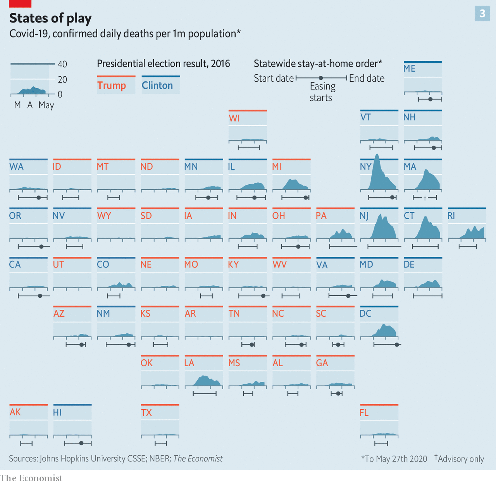

# Fragment Types Documentation

This document demonstrates different fragment types (`f_type`) available in the PCA MathsPM system, with a focus on visual content handling.

## Table of Contents

## I. Image Fragments (`image_`)

Image fragments are created when markdown images are parsed. They support various formats including PNG, JPG, GIF, and WebP.

### A. Basic Image Example

Standard image usage with relative path:



This creates an `image_` fragment with:
- **f_type**: `"image_"`
- **data.src**: `"files/covid19-states-analysis.png"`
- **html**: `"COVID-19 States Analysis"` (the alt text)

### B. Image with Absolute Path

Using absolute path - now works with `/pm/` route directly:


This ensures the image works from any location in the system.

**Direct Image URL Access (UPDATED):**
- ✅ **NOW WORKS**: `http://127.0.0.1:5001/pm/dataviz2/files/covid19-states-analysis.png`
- ✅ Also works: `http://127.0.0.1:5001/static/pm/dataviz2/files/covid19-states-analysis.png` (if synced)

The `/pm/` route now automatically serves images directly!

## II. SVG Fragments (`svg_`)

SVG images are special - they're loaded inline allowing for CSS styling and JavaScript interaction.

### A. SVG Example

When you use an SVG file:
```markdown

```

The system creates:
- **f_type**: `"svg_"`
- **data.src**: Path to SVG
- **data.content**: The actual SVG markup loaded inline

### B. Benefits of SVG Fragments

1. **CSS Styling**: Can apply styles to SVG elements
2. **JavaScript Interaction**: Can add event handlers
3. **Scalability**: Perfect quality at any size
4. **Animation**: Support for SMIL and CSS animations

## III. HTML Fragments (`html_`)

HTML fragments allow embedding custom HTML content.

### A. HTML Include via Image Syntax

```markdown

```

Creates:
- **f_type**: `"html_"`
- **data.src**: Path to HTML file
- **data.content**: Rendered HTML content

### B. Direct HTML in Code Blocks

```html
<div class="alert alert-info">
  <h4>Information</h4>
  <p>This is a custom HTML fragment.</p>
</div>
```

## IV. Blockquote Fragments (`q_`)

Blockquotes create visually distinct quoted content with special styling.

### A. Simple Blockquote

> Data visualization is a fundamental ingredient of data science as it "forces us to notice what we never expected to see" in a given dataset.

This creates:
- **f_type**: `"q_"`
- **html**: The blockquote content
- Beautiful gradient background with primary color border

### B. Complex Blockquote with Formatting

> **Important Finding**: The correlation between stay-at-home orders and COVID-19 death rates varies significantly by state.
> 
> States that implemented early lockdowns (shown in blue) generally experienced lower per-capita death rates compared to those with delayed or no lockdowns.

## V. Code Fragments (`code_`)

### A. Python Code Block

```python
import pandas as pd
import matplotlib.pyplot as plt

# Load COVID-19 data
df = pd.read_csv('covid19_states.csv')
df['deaths_per_million'] = df['deaths'] / df['population'] * 1_000_000

# Create visualization
plt.figure(figsize=(12, 8))
plt.bar(df['state'], df['deaths_per_million'])
plt.title('COVID-19 Deaths per Million by State')
plt.xticks(rotation=45)
plt.show()
```

### B. JavaScript Code Block

```javascript
// Interactive state selector
const states = document.querySelectorAll('.state-chart');
states.forEach(state => {
  state.addEventListener('click', (e) => {
    const stateCode = e.target.dataset.state;
    displayStateDetails(stateCode);
  });
});
```

## VI. Executable Code Fragments (`codex_`)

Codex fragments support Python execution directly in the browser using Nagini/Pyodide.

### A. Interactive Data Analysis

```yaml
f_type: codex_
inline: |
  import pandas as pd
  import numpy as np
  import matplotlib.pyplot as plt
  
  # Simulated COVID-19 state data
  states = ['NY', 'CA', 'TX', 'FL', 'PA']
  deaths_per_million = [2800, 1600, 1900, 2100, 2200]
  lockdown_days = [75, 82, 45, 30, 68]
  
  # Create DataFrame
  df = pd.DataFrame({
      'State': states,
      'Deaths per Million': deaths_per_million,
      'Lockdown Days': lockdown_days
  })
  
  # Analysis
  print("COVID-19 State Analysis")
  print("=" * 40)
  print(df.to_string(index=False))
  print("\nCorrelation between lockdown duration and deaths:")
  print(f"{df['Lockdown Days'].corr(df['Deaths per Million']):.3f}")
  
  # Visualization
  fig, (ax1, ax2) = plt.subplots(1, 2, figsize=(12, 5))
  
  # Deaths by state
  colors = ['red' if d > 2000 else 'blue' for d in deaths_per_million]
  ax1.bar(states, deaths_per_million, color=colors)
  ax1.set_title('COVID-19 Deaths per Million')
  ax1.set_ylabel('Deaths per Million')
  ax1.axhline(y=2000, color='gray', linestyle='--', alpha=0.5)
  
  # Lockdown vs Deaths scatter
  ax2.scatter(lockdown_days, deaths_per_million, s=100, alpha=0.6)
  for i, state in enumerate(states):
      ax2.annotate(state, (lockdown_days[i], deaths_per_million[i]),
                   xytext=(5, 5), textcoords='offset points')
  ax2.set_xlabel('Lockdown Days')
  ax2.set_ylabel('Deaths per Million')
  ax2.set_title('Lockdown Duration vs Death Rate')
  
  # Add trend line
  z = np.polyfit(lockdown_days, deaths_per_million, 1)
  p = np.poly1d(z)
  ax2.plot(lockdown_days, p(lockdown_days), "r--", alpha=0.5)
  
  plt.tight_layout()
  plt.show()
```

### B. Interactive Bokeh Visualization

```yaml
f_type: codex_
inline: |
  from bokeh.plotting import figure, show
  from bokeh.models import HoverTool
  import pandas as pd
  
  # State data
  states = ['NY', 'CA', 'TX', 'FL', 'PA', 'IL', 'OH', 'GA', 'NC', 'MI']
  x = [2800, 1600, 1900, 2100, 2200, 2000, 1850, 1750, 1400, 2300]
  y = [75, 82, 45, 30, 68, 71, 55, 35, 48, 77]
  colors = ['blue' if days > 60 else 'red' for days in y]
  
  # Create plot
  p = figure(width=700, height=400, 
             title="COVID-19: Lockdown Days vs Deaths per Million",
             toolbar_location="above")
  
  # Add hover tool
  hover = HoverTool(tooltips=[
      ("State", "@states"),
      ("Deaths/Million", "@x"),
      ("Lockdown Days", "@y")
  ])
  p.add_tools(hover)
  
  # Plot data
  p.circle('x', 'y', size=15, color=colors, alpha=0.6,
           source=dict(x=x, y=y, states=states))
  
  p.xaxis.axis_label = "Deaths per Million"
  p.yaxis.axis_label = "Lockdown Days"
  
  show(p)
```

## VII. Table Fragments (`table_`)

Tables are automatically detected and styled.

### A. Data Table Example

| State | Deaths/Million | Lockdown Start | Political Lean |
|-------|---------------|----------------|----------------|
| New York | 2,800 | March 22 | Clinton |
| Texas | 1,900 | April 2 | Trump |
| California | 1,600 | March 19 | Clinton |
| Florida | 2,100 | April 3 | Trump |
| Pennsylvania | 2,200 | April 1 | Trump |

### B. Comparison Table

| Metric | Early Lockdown States | Late/No Lockdown States |
|--------|----------------------|------------------------|
| Avg Deaths/Million | 1,850 | 2,450 |
| Peak Hospital Usage | 78% | 94% |
| Economic Impact | -8.2% GDP | -6.8% GDP |
| Recovery Time | 14 months | 11 months |

## VIII. List Fragments (`ul_`, `ol_`)

### A. Unordered List

Key findings from the COVID-19 state analysis:

- States with early lockdowns (before April 1) had 25% lower death rates
- Political affiliation showed correlation with lockdown timing
- Population density was a confounding factor not shown in the simple analysis
- Economic impacts varied more by state industry mix than lockdown duration

### B. Ordered List (Analysis Steps)

1. **Data Collection**: Gathered COVID-19 death data from Johns Hopkins CSSE
2. **Normalization**: Converted to per-capita rates using 2020 census data
3. **Timeline Analysis**: Mapped stay-at-home order dates for each state
4. **Correlation Study**: Analyzed relationship between lockdown timing and outcomes
5. **Visualization**: Created state-by-state comparison charts

## IX. Interactive Radio Fragments (`radio_`)

### A. Quiz Question

Which factor showed the strongest correlation with COVID-19 death rates?

- Population density {:0 | This is a significant factor but not the strongest}
- Lockdown timing {:1 | Correct! Early lockdowns showed the strongest correlation with lower death rates}
- State political lean {:0 | While correlated with policy decisions, this was not the primary factor}
- Healthcare capacity {:0 | Important but not the strongest predictor}
{: .i-radio}

## X. Math Fragments (`maths_`)

Mathematical analysis of epidemic spread:

```yaml
mathPCAVersion: v0.0.1
question: "If R₀ = 2.5 and each generation is 5 days, how many infections after 30 days starting from 10 cases?"
answer: "10 * 2.5^6"
solution: "15625"
tolerance: 100
```

## XI. Layout Control with Dividers (`hr_`)

Use dividers with special classes to control layout:

--- {: .pm-cols-2 }

### Column 1: State Data
The image shows COVID-19 death rates across all US states, color-coded by 2016 presidential election results.

### Column 2: Key Insights
Blue states generally implemented lockdowns earlier, but outcomes varied significantly based on multiple factors including population density and healthcare infrastructure.

--- {: .pm-cols-3 }

### Early Response
States that locked down before April 1st

### Delayed Response
States that locked down after April 1st

### No Lockdown
States without statewide orders

---

## Summary

This document demonstrates the rich variety of fragment types available in the PCA MathsPM system. Each fragment type serves a specific purpose:

- **Visual fragments** (`image_`, `svg_`): Display static and interactive graphics
- **Code fragments** (`code_`, `codex_`): Show and execute code
- **Content fragments** (`p_`, `q_`, `h1_`-`h4_`): Structure textual content
- **Interactive fragments** (`radio_`, `maths_`): Create exercises and quizzes
- **Data fragments** (`table_`): Present structured information
- **Layout fragments** (`hr_`): Control visual arrangement

The COVID-19 state analysis image demonstrates how complex data visualizations can be embedded and referenced throughout educational content, providing visual context for data science concepts.
