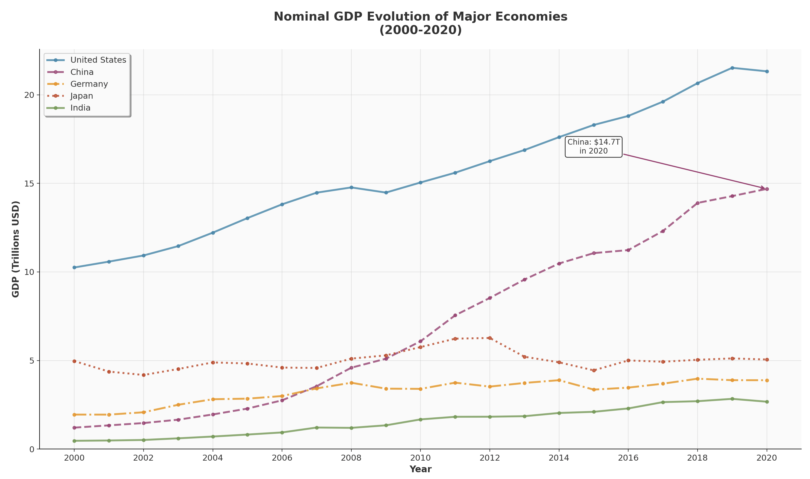
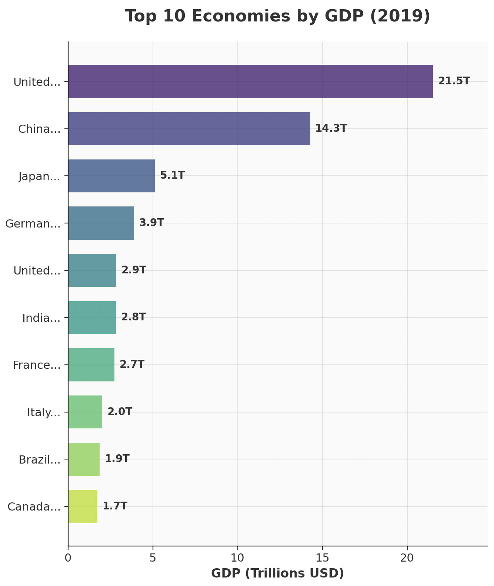
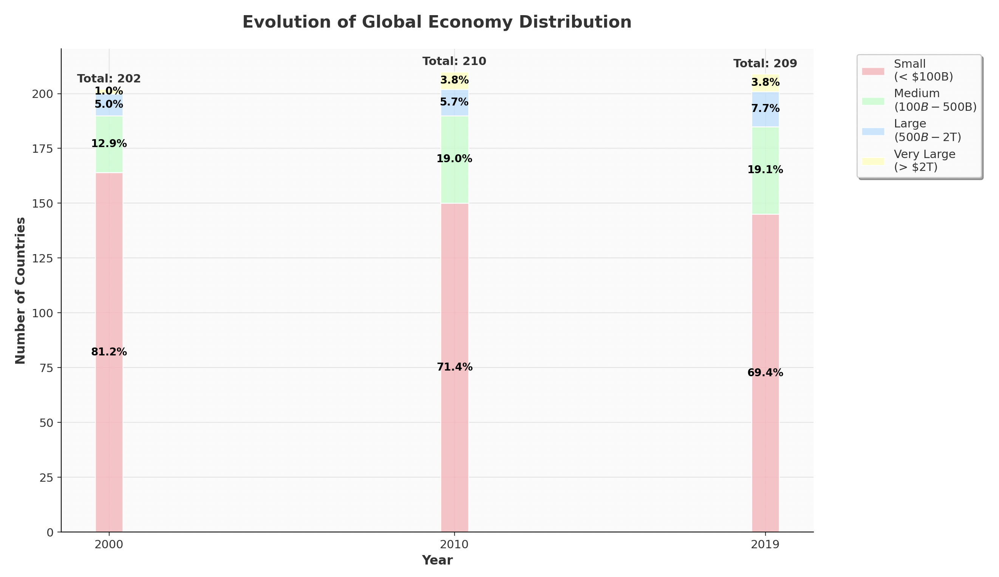
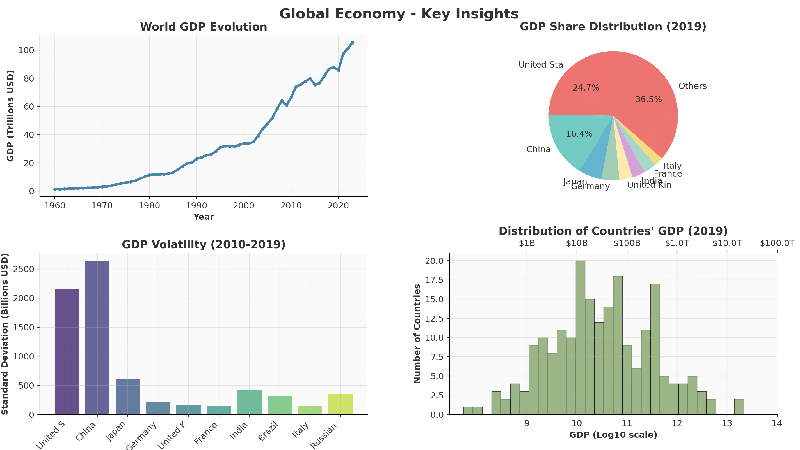

# Practical work with `matplotlib`


[TOC]


## About those exercises

### Dataset


We'll use some panel data: GDP (nominal) per year and per country. The dataset and its documentation are available [here](https://github.com/datasets/gdp).

### Objective

### Apply what you have learned during this session: 


- [**Course overview**](00_plan.md) 
- [**Graphic Semiology Fundamentals**](session_1_a.md)
    - [4. Visual Variables](session_1_a1_visual.md)
- <span class="text-base-content/60"> [**Installing Python, the clean way**](session_1_b.md) </span>
- [**The Zen of Python**](session_1_c.md)
- [**Data Types Classification and introduction to `matplotlib`**](session_1_d.md)


### Making graphs as elegant as possible


Since `matplotlib` enables us to make very flexible graphs, we can make them as elegant as possible. This is a good exercise to learn how to use `matplotlib` to its full potential.
{: .alert .alert-success .alert-soft}

## Dataset Information
- **Source**: World Bank GDP data
- **URL**: `https://raw.githubusercontent.com/datasets/gdp/master/data/gdp.csv`
- **Key Columns**: `Country Name`, `Country Code`, `Year`, `Value` (GDP in USD)
- **Time Range**: 1960-2020


### Important information


Some entities are not countries, like regions, income groups, etc. In some cases, you should exclude them, in some other cases they can be very useful. Here is the list of these entities.
{: .alert .alert-info .alert-soft}


```python
non_country_entities = [
    ['Africa Eastern and Southern', 'AFE'],
    ['Africa Western and Central', 'AFW'],
    ['Arab World', 'ARB'],
    ['Caribbean small states', 'CSS'],
    ['Central Europe and the Baltics', 'CEB'],
    ['Channel Islands', 'CHI'],
    ['Early-demographic dividend', 'EAR'],
    ['East Asia & Pacific', 'EAS'],
    ['East Asia & Pacific (IDA & IBRD countries)', 'TEA'],
    ['East Asia & Pacific (excluding high income)', 'EAP'],
    ['Euro area', 'EMU'],
    ['Europe & Central Asia', 'ECS'],
    ['Europe & Central Asia (IDA & IBRD countries)', 'TEC'],
    ['Europe & Central Asia (excluding high income)', 'ECA'],
    ['European Union', 'EUU'],
    ['Fragile and conflict affected situations', 'FCS'],
    ['Heavily indebted poor countries (HIPC)', 'HPC'],
    ['High income', 'HIC'],
    ['IBRD only', 'IBD'],
    ['IDA & IBRD total', 'IBT'],
    ['IDA blend', 'IDB'],
    ['IDA only', 'IDX'],
    ['IDA total', 'IDA'],
    ['Late-demographic dividend', 'LTE'],
    ['Latin America & Caribbean', 'LCN'],
    ['Latin America & Caribbean (excluding high income)', 'LAC'],
    ['Latin America & the Caribbean (IDA & IBRD countries)', 'TLA'],
    ['Least developed countries: UN classification', 'LDC'],
    ['Low & middle income', 'LMY'],
    ['Low income', 'LIC'],
    ['Lower middle income', 'LMC'],
    ['Middle East & North Africa', 'MEA'],
    ['Middle East & North Africa (IDA & IBRD countries)', 'TMN'],
    ['Middle East & North Africa (excluding high income)', 'MNA'],
    ['Middle income', 'MIC'],
    ['North America', 'NAC'],
    ['OECD members', 'OED'],
    ['Other small states', 'OSS'],
    ['Pacific island small states', 'PSS'],
    ['Post-demographic dividend', 'PST'],
    ['Pre-demographic dividend', 'PRE'],
    ['Small states', 'SST'],
    ['South Asia', 'SAS'],
    ['South Asia (IDA & IBRD)', 'TSA'],
    ['Sub-Saharan Africa', 'SSF'],
    ['Sub-Saharan Africa (IDA & IBRD countries)', 'TSS'],
    ['Sub-Saharan Africa (excluding high income)', 'SSA'],
    ['Upper middle income', 'UMC'],
    ['World', 'WLD']
]
```

### Setup Code (Run First)

#### Using `pyodide`

```python
import matplotlib.pyplot as plt
import pandas as pd
import numpy as np
from pyodide.http import open_url

# Load data
url = "https://raw.githubusercontent.com/datasets/gdp/master/data/gdp.csv"
df = pd.read_csv(open_url(url))

# Exclude non-country entities (regions, income groups)
non_country_entities  = {
    'AFE', 'AFW', 'ARB', 'CSS', 'CEB', 'CHI', 'EAR', 'EAS', 'TEA', 'EAP', 
    'EMU', 'ECS', 'TEC', 'ECA', 'EUU', 'FCS', 'HPC', 'HIC', 'IBD', 'IBT', 
    'IDB', 'IDX', 'IDA', 'LTE', 'LCN', 'LAC', 'TLA', 'LDC', 'LMY', 'LIC', 
    'LMC', 'MEA', 'TMN', 'MNA', 'MIC', 'NAC', 'OED', 'OSS', 'PSS', 'PST', 
    'PRE', 'SAS', 'TSA', 'SSF', 'TSS', 'SSA', 'SST', 'UMC', 'WLD'
}
df_countries = df[~df['Country Code'].isin(non_country_entities)]

df_non_countries = df[df['Country Code'].isin(non_country_entities)]

print(f"Dataset loaded: {df_countries.shape[0]} rows, {df_countries['Country Name'].nunique()} countries")
```


#### Local execution 


```python

import matplotlib.pyplot as plt
import pandas as pd
import numpy as np

# Exclude non-country entities (regions, income groups)
non_country_entities  = {
    'AFE', 'AFW', 'ARB', 'CSS', 'CEB', 'CHI', 'EAR', 'EAS', 'TEA', 'EAP', 
    'EMU', 'ECS', 'TEC', 'ECA', 'EUU', 'FCS', 'HPC', 'HIC', 'IBD', 'IBT', 
    'IDB', 'IDX', 'IDA', 'LTE', 'LCN', 'LAC', 'TLA', 'LDC', 'LMY', 'LIC', 
    'LMC', 'MEA', 'TMN', 'MNA', 'MIC', 'NAC', 'OED', 'OSS', 'PSS', 'PST', 
    'PRE', 'SAS', 'TSA', 'SSF', 'TSS', 'SSA', 'SST', 'UMC', 'WLD'
}
df_countries = df[~df['Country Code'].isin(non_country_entities)]

df_non_countries = df[df['Country Code'].isin(non_country_entities)]

print(f"Dataset loaded: {df_countries.shape[0]} rows, {df_countries['Country Name'].nunique()} countries")
```


## Exercises

### Exercise 1: Time Series Comparison

**Task**: Create a line plot comparing GDP evolution (2000-2020) for 5 economies. You will justify your choice of countries.

**Requirements**:

- Different colors and line styles for each country
- GDP values using a defensible scale
- Proper legend with country names
- Grid with 30% transparency
- Title
- 1 annotation


**Example**:


{: .max-w-[600px] .mx-auto}


### Exercise 2: Bar Chart

**Task**: Create a horizontal bar chart of the top 10 countries by 2019 GDP.

**Requirements**:

- Use the 2019 data (more complete than 2020)
- Horizontal bars with custom colors (use a colormap like 'viridis')
- GDP values in trillions on x-axis
- Country names on y-axis (truncate long names to 6 characters)
- Grid
- Title: "Top 10 Economies by GDP (2019)"
- Figure size: (12, 8)

**Example**:


{: .max-w-[500px] .mx-auto}


### Exercise 3: Working with ordinal data

**Task**: Create a stacked bar chart showing the distribution of countries across different GDP categories over time.

**Context**: We'll transform continuous GDP data into ordinal categories (Small, Medium, Large, Very Large economies) and visualize how the global economic landscape has evolved.

**Requirements**:

- Use 2000, 2010, and 2019 data for comparison
- Create 4 GDP categories using `pd.cut()` or `pd.qcut()`:
  - "Small" (< $100B)
  - "Medium" ($100B - $500B) 
  - "Large" ($500B - $2T)
  - "Very Large" (> $2T)
- Create a stacked bar chart showing count of countries in each category by year
- Use distinct colors for each category (suggest using a categorical colormap)
- Add percentage labels on each stack segment
- Title: "Evolution of Global Economy Distribution"
- Figure size: (10, 6)
- Legend positioned outside the plot area


**Example**:


{: .max-w-[500px] .mx-auto}


### Exercise 4: Subplots example

**Task**: Create a 2x2 subplot showing different aspects of global economy.

**Requirements**:

1. **Top-left**: Line plot of World GDP over time (use 'WLD' code from original data)
2. **Top-right**: Pie chart of 2019 GDP share for top 8 countries + "Others"
3. **Bottom-left**: Bar chart showing GDP volatility (standard deviation 2010-2019) for top 10 economies
4. **Bottom-right**: Histogram of all countries' 2019 GDP (log scale, 30 bins)

**Additional Requirements**:

- Figure size: (16, 12)
- Consistent color schemes within each subplot
- Proper titles, labels, and legends for each subplot
- Main title: "Global Economy - Key Insights"
- Use `plt.tight_layout()` for spacing


**Example**:


{: .max-w-[500px] .mx-auto}
