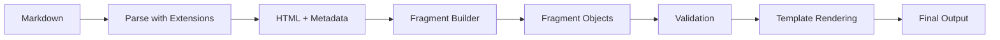

# 📚 PM System Documentation

Welcome to the Pedagogical Message (PM) system documentation. This folder contains comprehensive guides and references for creating rich, interactive educational content.

## 📖 Documentation Structure

### 🎯 Quick Start
- **[Fragments Quick Reference](fragments_quick_reference.md)** - One-page cheat sheet for all fragment types
- **[All Fragments Showcase](all_fragments_showcase.md)** - Live examples of every fragment type

### 📝 Detailed Guides

#### Text & Structure
- **[Text Fragments Guide](text_fragments_guide.md)** - Complete guide to headings, paragraphs, lists, and text formatting

#### Interactivity
- **[Interactive Fragments Guide](interactive_fragments_guide.md)** - Radio buttons, math input, graphs, and interactive code
- **[i-Radio Fragment Guide](i_radio_fragment_guide.md)** - Deep dive into the radio button system with flags

#### Media & Code
- **[Code & Media Fragments Guide](code_media_fragments_guide.md)** - Code blocks, images, SVGs, and visualizations

## 🚀 Getting Started

### 1. Basic PM Structure

Every PM file starts with YAML frontmatter:

```yaml
---
title: Your PM Title
description: Brief description
chapter: Chapter Name
---
```

### 2. Essential Fragments

The most commonly used fragments:

```markdown
# Main Title

Introduction paragraph with **emphasis**.
{: .lead}

## Section

Regular content goes here.

- Bullet point 1
- Bullet point 2

What's the answer?

- Wrong{:21}
- Correct{:20}
{: .i-radio}
```

### 3. Adding Interactivity

Make your content engaging:

```yaml
codexPCAVersion: 1
script_path: "examples/hello.py"
```

## 🎨 Fragment Categories

### Core Fragments
- **Text**: h1_, h2_, h3_, h4_, p_, q_
- **Lists**: ul_, ol_, lbl_
- **Structure**: toc_, hr_

### Interactive Fragments
- **radio_**: Multiple choice questions
- **maths_**: Mathematical input
- **graph_**: Function plotting
- **codex_**: Executable code

### Media Fragments
- **image_**: Static images
- **svg_**: Vector graphics
- **code_**: Syntax-highlighted code

### Data Fragments
- **table_**: Data tables
- **tabvar_**: Variation tables

## 🔧 Advanced Features

### Styling with Attributes
```markdown
Important note here.
{: .lead .bg-primary .text-center}
```

### Combining Fragments
Mix different fragment types for rich content:
- Text explanation
- Visual diagram
- Interactive question
- Code example

### Custom Classes
Apply CSS classes for precise control:
- `.mx-auto` - Center horizontally
- `.max-w-[size]` - Limit width
- `.bg-[color]` - Background colors
- `.text-[style]` - Text styling

## 📁 Project Structure

```
pms/
├── documentation/     # You are here
│   ├── README.md     # This file
│   ├── fragments_quick_reference.md
│   ├── all_fragments_showcase.md
│   ├── text_fragments_guide.md
│   ├── interactive_fragments_guide.md
│   ├── code_media_fragments_guide.md
│   └── i_radio_fragment_guide.md
├── examples/         # Example PMs
│   └── i_radio_example.md
├── corsica/         # Corsica project
│   ├── a_troiz_geo.md
│   ├── e_seconde_stats_python.md
│   └── files/      # Project assets
└── pyly/           # Python lessons
    ├── 00_index.md
    ├── 01_premiers_pas.md
    └── files/      # Lesson assets
```

## 🎯 Best Practices

### Content Organization
1. **Clear hierarchy** - Use headings consistently
2. **Logical flow** - Build concepts progressively
3. **Visual breaks** - Use dividers and spacing
4. **Consistent styling** - Apply classes uniformly

### Interactivity
1. **Immediate feedback** - Use flags for radio buttons
2. **Clear instructions** - Explain what users should do
3. **Progressive difficulty** - Start simple, increase complexity
4. **Helpful hints** - Add non-flagged hints in radio lists

### Performance
1. **Optimize images** - Compress and use appropriate formats
2. **Lazy loading** - Large content loads on demand
3. **Code splitting** - Break large examples into parts
4. **Caching** - Leverage browser caching

### Accessibility
1. **Alt text** - Describe all images
2. **Semantic HTML** - Use proper heading hierarchy
3. **Keyboard navigation** - Ensure all interactive elements are accessible
4. **Contrast** - Maintain readable color combinations

## 🔍 Fragment Processing Pipeline



## 💡 Tips & Tricks

### Quick Testing
Test fragments locally by creating a simple PM file and viewing it in the browser.

### Fragment Validation
The system validates fragment structure automatically - check console for errors.

### Custom Extensions
The markdown processor supports several extensions:
- `toc` - Table of contents
- `tables` - Enhanced tables
- `fenced_code` - Code blocks
- `attr_list` - Attribute lists `{: .class}`
- `full_yaml_metadata` - YAML frontmatter

### Debugging
Enable verbosity in PM builder for detailed processing information.

## 📚 Learning Path

1. Start with **[Fragments Quick Reference](fragments_quick_reference.md)**
2. Explore **[All Fragments Showcase](all_fragments_showcase.md)**
3. Read specific guides as needed
4. Create your own PM files
5. Test and iterate

## 🤝 Contributing

When creating new fragment types:
1. Add to `FType` enum
2. Implement in `FragmentBuilder`
3. Add validation rules
4. Create template rendering
5. Document with examples

## 📞 Support

For questions or issues:
- Check existing documentation
- Review example PMs in `/pms/examples/`
- Look at test files for edge cases
- Consult the fragment builder source

---

**Happy teaching with PM fragments! 🎓**
